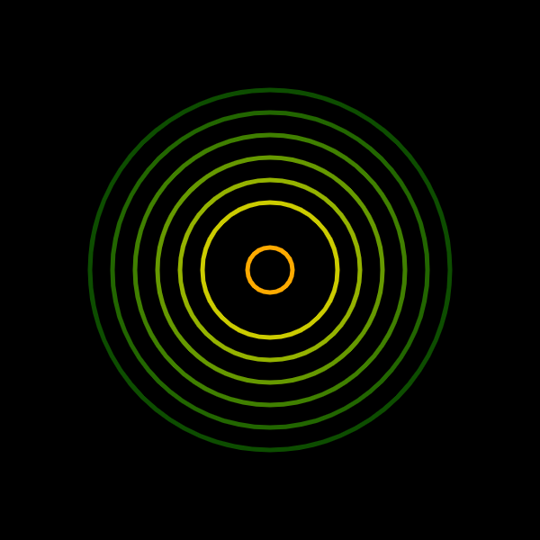
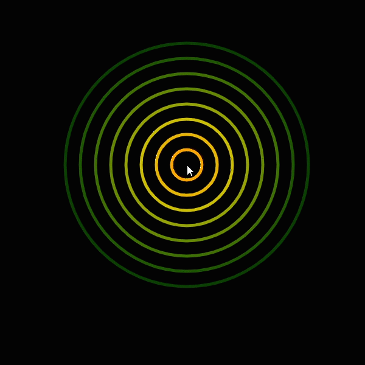

## Example – Catalog by John Whitney
*by Yuguang Zhang*

In this tutorial you'll learn how to recode a few seconds of animation from the piece [Catelog](https://youtu.be/TbV7loKp69s?t=204) by the visual artist [John Whitney](https://en.wikipedia.org/wiki/John_Whitney_(animator)) . Along the tutorial we'll cover the use of some built-in variables of p5.js, including `mouseX`, `mouseY` and `frameCount`, how to declare and use your own variable, and the use of `map()`, `constrain()` and `random()`.

<p align="center">
  
</p>

### Variables
Variables are used for storing values. You can think of it as a placeholder for something that can be changed over time, either by a computer program, or by yourself.

#### Built-in Varialbes of p5.js
In p5.js, there're a number of system (or built-in) variables that you can use directly in your code. The most common ones include `mouseX` and `mouseY`, the X and Y positionS of your mouse inside the browser window, and `frameCount`, the number of frames that have been displayed since the program started.

#### Declared Variables
You can also create, or declare, your own variables to store any values you want the computer to remember, and change in the future, such as the number of columns and rows of a customized grid, or the degress of a particular triangle that we want p5 to rotate. The way to do it is by using a `let` or `var` statement, e.g. `let numberOfRows = 5` or `var numberOfColumns = 10`. Then you can change its value by assigning it a new number, a variable, or any js expression, e.g. `numberOfRows = 10`, or `numberOfRows = numberOfColumns`, or `numberOfRows = numberOfColumns * 2`.

#### The Static Basis Sketch
In the following sections, we'll try to apply the concept of variable to recode the John Whitney animation step by step. First uncomment section 1 inside the `draw()` fuction of the example, and comment out everything else. You should be able to see a static drawing that shows 8 concentric circles in different colors. This will be our basis sketch for creating final the animation.

<p align="center">
  
</p>

#### The Custom Variable We'll be Using In This Example
In the following sections, we'll explore the concept of variables through built-in variables and a custom variable called `r`, which stands for radius. We'll plug this variable into our sketch to control the size of the circles, and experiment with different ways to change this r value to animate our sketch like John Whitney. Let's begin by declaring `r` at the beginning (line 9 of the sketch) like this:
```js
    //r stands for radius, and it is a variable.
    let r = 50;
```


### System / Built-in Variables of p5.js

#### Using "mouseX" and "mouseY" to control location of circles
You can use system variables directly in your sketch - in this case, we'll be controlling the location of the circles with the X position of our mouse inside the browser window. To do so, we can replace the x and y coordinates inside each `ellipse()` function with mouseX and mouseY like this: `ellipse(mouseX, mouseY, 50);`. 

```js
    stroke(40, 100, 100);
    strokeWeight(5);
    ellipse(mouseX, mouseY, 50);
```

Uncomment section 2 inside the `draw()` fuction of the example, and comment out everything else to see all 8 circles following your mouse.

<p align="center">
  
</p>


#### Using "mouseX" to control the size of all circles
Since variables are just placeholders, you can use them to control any number in your sketch. For example, instead of location, we can use `mouseX` to control the size of all circles. To do so, we can replace the size parameters (i.e. width and/or height) inside each `ellipse()` function with mouseX like this: `ellipse(0, 0, mouseX);`. 

In many cases though, the range of `mouseX` (which goes from 0 to width) may not be the exact range you want to use. In this case, we can map the mouseX values to a better range beforehand using the `map()` function, so that the change in size fits better to our sketch. Then we can use our custom variable `r` (which we declared in line 9 of the sketch) to hold the mapped value like this: `r = map(mouseX, 0, width, 20, 300);`. Then finally, we can use r to control the size of the circles: `ellipse(0, 0, r);`.

```js
    // map r to mouse
    r = map(mouseX, 0, width, 20, 300);

    // set the stroke color in HSB & weight, then draw the 1st inner circle
    stroke(40, 100, 100);
    strokeWeight(5);
    ellipse(0, 0, r);
```

Uncomment section 3 inside the `draw()` fuction of the example, and comment out everything else to see the size of all 8 circles controled by your mouse.

<p align="center">
  
</p>


#### Using "frameCount" to control size of circles
Besides `mouseX`, we can also use another built-in variable `frameCount`, the number of frames that have been displayed since the program started, to control the size of all circles. To do so, we can replace our formula for `r` from using `mouseX` to using `frameCount` like this: `r = map(frameCount, 0, 300, 20, 200);`. Since `frameCount` will keep growing as time goes by, `r` will keep growing as well. If we don't want `r` to grow forever, we can use the `constrain()` function to constrain the value of `r`. The nice thing about using a variable is that we can update it as many times as we want - so, after `r` is mapped, we can then contrain it like this: `r = constrain(r, 0, 200);`.

```js
    // map r to frameCount
    r = map(frameCount, 0, 200, 20, 200); // map frameCount to an increasing r
    r = constrain(r, 0, 200); // constrain r so that it does not grow forever

    // set the stroke color in HSB & weight, then draw the 1st inner circle
    stroke(40, 100, 100);
    strokeWeight(5);
    ellipse(0, 0, r);
```

<p align="center">
  
</p>

If we look back at John Whitney's animation, we'll find that the circles are decreasing in size. So we can also reverse-map `frameCount` to `r` by changing the start and end target values, so that the more frames our sketch has displayed, the smaller the size of our circles.

```js
    // map r to frameCount
    r = map(frameCount, 0, 200, 200, 20); // map frameCount to a decressing r
    r = constrain(r, 0, 200); // constrain r so that it does not shrink forever
```

<p align="center">
  
</p>

Uncomment section 4 inside the `draw()` fuction of the example, and comment out everything else to see the size of all 8 circles controled by `frameCount`.


#### Final Tuning The Size
One interesting thing in Whitney's piece is that the circles do not grow/shrink in the same speed & direction. If we take a closer look, we will find that the yellow/orange ones are shrinking, while the green ones are growing. That implies our variable `r` should actually be controlled by two different "forces", or "factors" - one adding up over time, the other getting smaller over time. Now that we've already had the reversely-mapped shrinking `r`, we can fine-tune the amount of `r` changes for each circle by adding a positive "offset" to it, so that each circle can grow/shrink in different rates. In this case, we can use the `frameCount` variable again as an offset by plugging it into the `ellipse()` function like this: `ellipse(0, 0, r + frameCount * "percentage");`. In this way, the size of each circle is "balanced" differently, thereby having different growing/shrinking rates.


```js
    // map r to frameCount
    r = map(frameCount, 0, 200, 200, 20);

    //some code ...

    // 3rd circle
    stroke(60, 100, 80);
    strokeWeight(5);
    ellipse(0, 0, r + frameCount * 0.3);

    //some code ...

    // 7th circle
    stroke(100, 100, 40);
    strokeWeight(5);
    ellipse(0, 0, r + frameCount * 1.1);
```

<p align="center">
  
</p>

#### BONUS: Circles with Random Color
Similar to how we use the variable `r` to control the size, we can also create other variables to change other things. The final bonus sesion does so by using a variable `h`, which stands for hue, to control the color of each circle. By assigning a random number to `h` using the `random()` function before we draw each circle, we now have 8 circles in differnt colors. Try changing the number inside the `randomSeed()` function to see what happens!


```js
    //Use random to change the colors of the circles
    //change the randomSeed number to see what happens!
    randomSeed(3600);
    let h; // h stands for hue

    // get a random hue color, then draw the 1st inner circle
    h = random(0, 360);
    stroke(h, 100, 100);
    strokeWeight(5);
    ellipse(0, 0, r);
```

<p align="center">
  
</p>