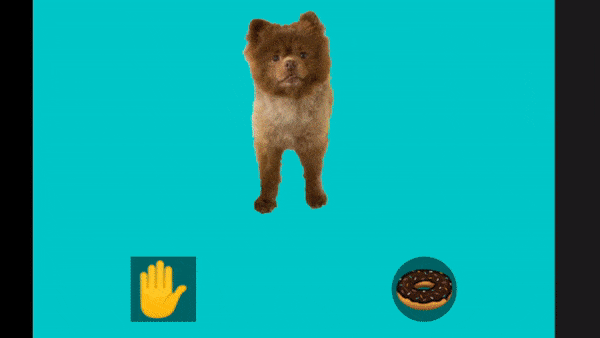
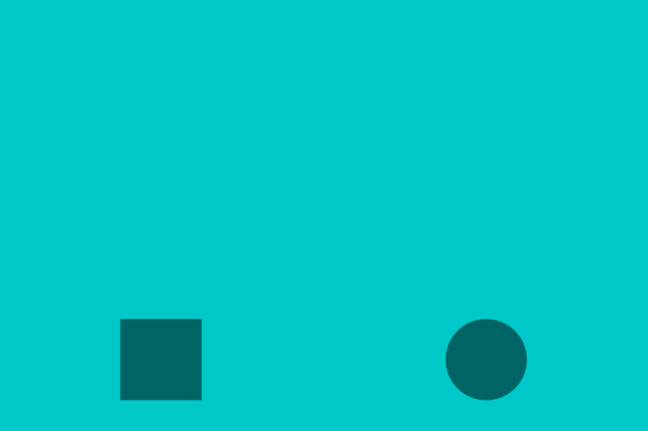
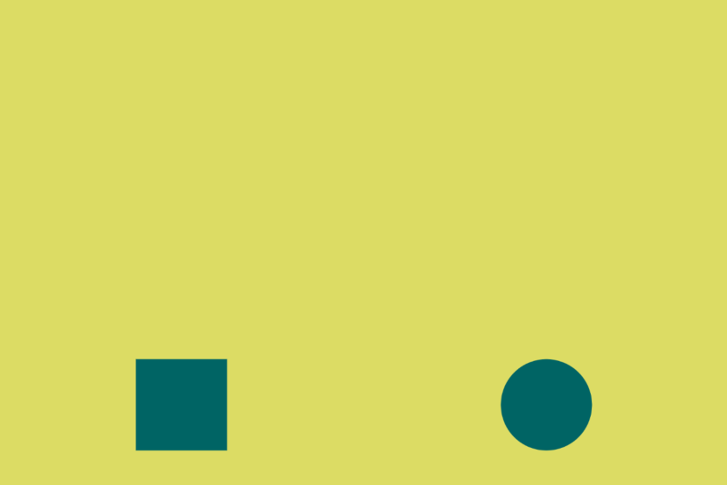
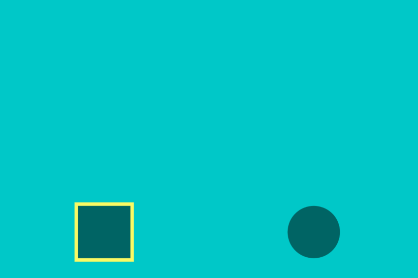
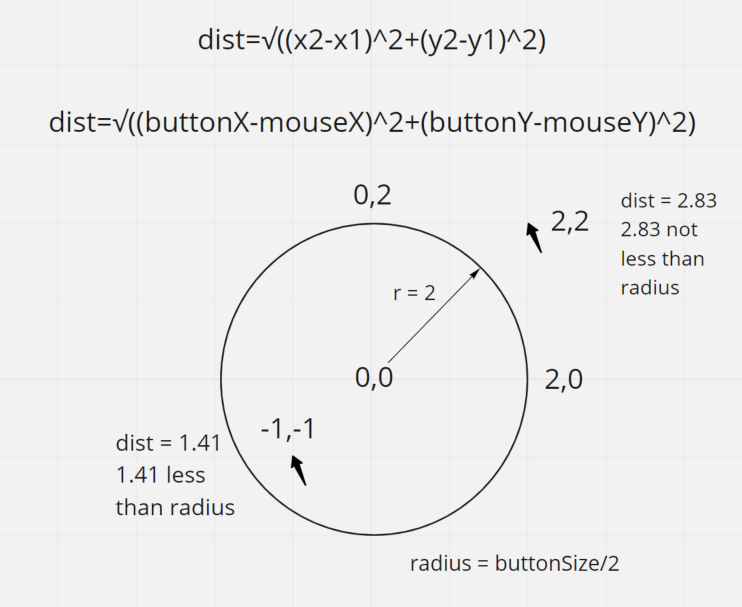
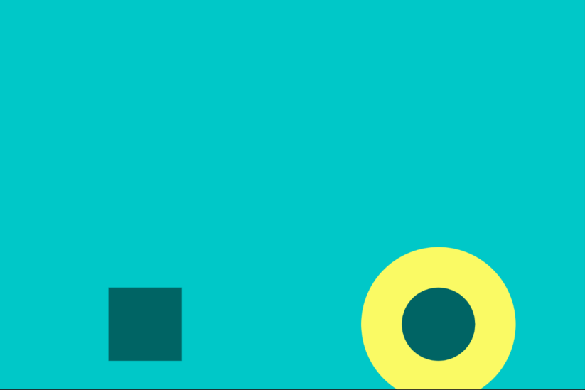
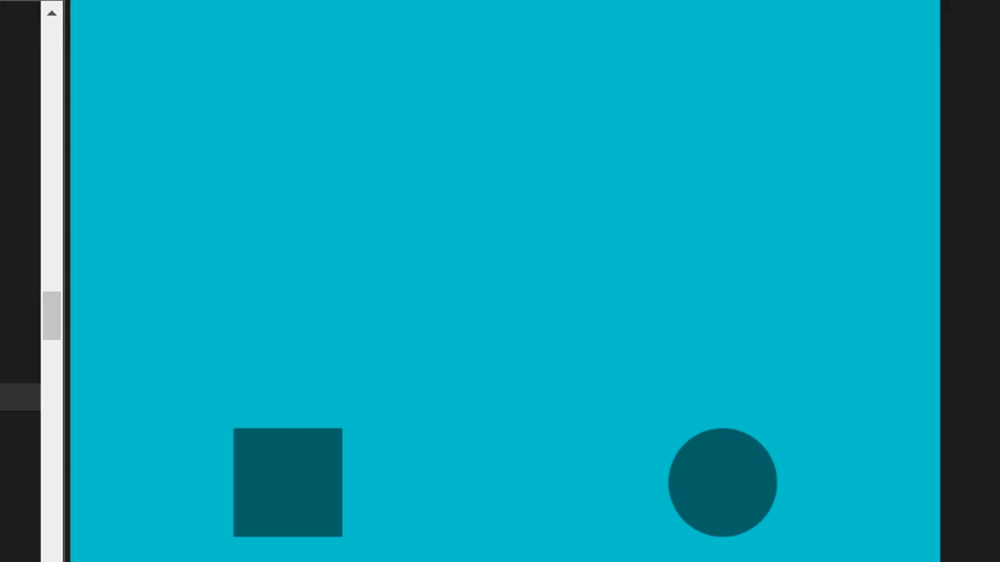
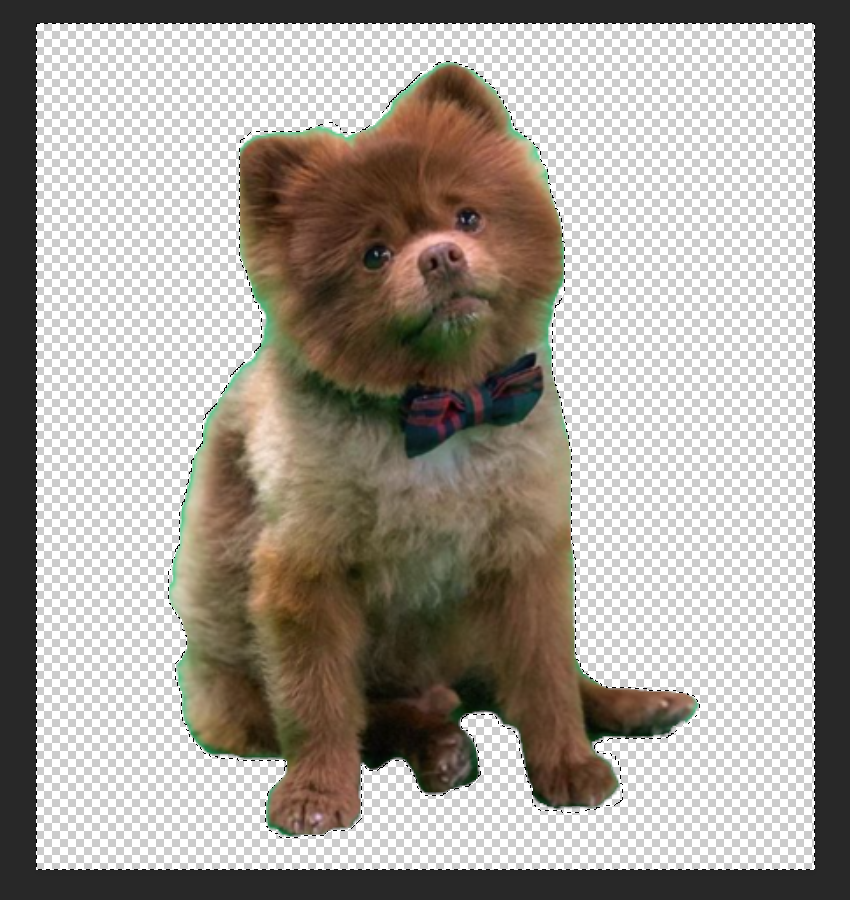

# Bertie Buttons -- Booleans, If Statements, && DIY Buttons
*by August Luhrs*

special thanks to [Bertie](https://www.instagram.com/bertiebertthepom/)! <3 <3 <3 

[Link to Final Sketch in p5 Editor](https://editor.p5js.org/DeadAugust/sketches/iMudwwu9h)



## Intro: Why Bools? 
You can think of conditional statements like the choices in a "Choose Your Own Adventure" book or game. Each moment is followed by a choice (*do you want to take the treasure or do you want to run away?*), then that choice defines what you see next (*if you took the treasure, turn to page 69. if you ran away, turn to page 420*). This branching path of choice is like the stages in your p5.js sketch.

Every decision that changes a state within your sketch can be represented with a boolean (*yes/no, true/false, 0/1*), and the internal logic of your sketch will follow the path that you outline using logical operators (ex. '&&' *AND*) and the conditional statements they make up `(if(tookTreasure && isBrave))`.

Conditional statements and comparisons are great ways of establishing logic within your sketch. You can create individual scenes or stages within one draw loop just by using booleans as "checkpoints" that will tell the sketch to show or do different things depending on which booleans are true or false. Like a river that flows different directions based on which dams are up or down.

Today we will be creating some DIY buttons, and then using those buttons to tell a **cute dog** to sit so it can get a treat.

## Part One: Let's Make Our Buttons
In this section, we'll:
* set up our sketch
* create two button shapes with relative positions

We want to start by making two buttons. We're going to explore the difference between a toggle (square) that switches on and off and a pushbutton (circle) that is only on when it's being held down.

### Set up the sketch and relative buttons
```js
//button variables
let buttonSize; 
let toggleButtonX, toggleButtonY, pushButtonX, pushButtonY;

function setup() {
  //wide canvas
  createCanvas(600, 400);
  
  //we want all our shape coordinates drawn from the CENTER
  rectMode(CENTER);
  imageMode(CENTER);
  
  //we don't want our shapes to have an outline (stroke)
  noStroke();

  //all our buttons will be the same relative size, 1/8 of the canvas' width
  buttonSize = width/8;
  
  //the toggle button is on the left bottom
  toggleButtonX = width/4;
  toggleButtonY = 5*height/6;
  
  //the push button is on the right bottom
  pushButtonX = 3*width/4;
  pushButtonY = 5*height/6;
}

function draw(){ 
    background(0,200,200);

    //draw the toggle button
    fill(0,100,100);
    rect(toggleButtonX, toggleButtonY, buttonSize);
    
    //draw the push button
    fill(0,100,100);
    ellipse(pushButtonX, pushButtonY, buttonSize);
}
```



Right now these are fake buttons! They don't do anything but look pretty.

## Part Two: What Does The Toggle Button Do?
In this section, we'll:
* go over the conditionals that allow us to click the square toggle button
* set up our first bool so we can toggle a light on and off
* then we'll highlight the toggle button when it's pressed

### How do we know when we click within the square?
We need a conditional statement for each of the four sides of the square, and we can check to see if the position of the mouse is within the bounds of that particular side when the mouse is pressed/clicked.

*buttonSize/2 corresponds to the distance from the center to that side edge*

```js
function mousePressed(){
  //testing the button conditions
  if(mouseX > buttonX - buttonSize/2){
   console.log('clicked to the right of the left edge'); 
  }
  if(mouseX < buttonX + buttonSize/2){
   console.log('clicked to the left of the right edge'); 
  }
  if(mouseY > buttonY - buttonSize/2){
   console.log('clicked below the top edge'); 
  }
  if(mouseY < buttonY + buttonSize/2){
   console.log('clicked above the bottom edge'); 
  }
}
```
But there's a way to consolidate all these different if statements into one!

```js
//consolidating the button conditions
if (mouseX > toggleButtonX - buttonSize/2 && //left edge and
    mouseX < toggleButtonX + buttonSize/2 && //right edge and
    mouseY > toggleButtonY - buttonSize/2 && // top edge and
    mouseY < toggleButtonY + buttonSize/2){ // bottom edge
    console.log('button clicked');
}
```
Now, how can we know when we've toggled that button on and off and keep it that way even when we're not holding the button down? With a boolean!

*Note: it's always a good idea to name booleans with "is" so that we get a clear sense of what that boolean represents*

```js
let isToggleButtonDown = false; //this starts false because at the beginning of the sketch the button is not down
```
Now lets add that boolean to the earlier if statemtent and add something that changes based on whether that button "is" down or not (true or false).

What we're looking for is:
**When** the button is pressed, **Then** Flip the Boolean

The When is that if() statement, but how do we change the boolean from true to false and vice versa?

We *could* go overboard and change that boolean like so:
```js
    if(isToggleButtonDown){ // same as if(isToggleButtonDown == true)
        isToggleButtonDown = false;
    }
    if(!isToggleButtonDown){ //same as if(isToggleButtonDown == false)
        isToggleButtonDown = true;
    }
```
But luckily, we can flip a boolean in a much simpler way by using the ! (not) operator, because to change a thing, we don't need to know what it is, we only need to know that it's going to become what it's **not**.

```js
isToggleButtonDown = !isToggleButtonDown
```
So, in that statement, it looks like this:

```js
if (mouseX > toggleButtonX - buttonSize/2 && //left edge and
    mouseX < toggleButtonX + buttonSize/2 && //right edge and
    mouseY > toggleButtonY - buttonSize/2 && // top edge and
    mouseY < toggleButtonY + buttonSize/2){ // bottom edge
    console.log('button clicked');
    
    isToggleButtonDown = !isToggleButtonDown;
}
```

But what can we do with this bool now? Well anything that goes back and forth is essentially a switch that goes on and off -- so lets make it a light switch.

We'll add the following to the if statement:

```js
console.log("Is the light on? " + isToggleButtonDown);
```

Because we only want to "turn the lights on" when the button is down, we check for that first with an if(isToggleButtonDown). Since the button not being pressed is the default, we can make that happen in several different ways. The following are all equivalent ways of doing that:

```js
  else if (!isToggleButtonDown)
  else if (isToggleButtonDown != true)
  if(!isToggleButtonDown)
  else  
```

We're going to just use the else, because that's the simplest way and (usually) therefore the most reliable. So we'll add this to the draw loop, replacing the background():

```js
  //testing the toggle by changing the background color
  if(isToggleButtonDown){ //if button is down, turn lights on
    background(220,220,100);
  } 
  else { // else, keep the default background
    background(0, 200, 200);
  }
```



But wouldn't it be great if the button itself told us when it was on and off? We all know how frustrating it is on the internet or in meatspace when we can't tell when a button is pressed.

Since the light's just a test, let's get rid of that and instead use that same logic to get the button to light up when it's pressed down. To do that, we'll draw a special "lit" rectangle as a highlight behind our button rectangle:

```js
//toggle button highlight
if(isToggleButtonDown){
    fill(250,250,100);
    rect(toggleButtonX, toggleButtonY, buttonSize + 10); //just slightly bigger than the button rectangle
    isSitting = true;
} //we don't need an else yet
```



That's it for the toggle!

## Part Three: What Does The Push Button Do?
In this section, we'll:
* look at how we can use dist() to push a circular button
* go over mousePressed vs mouseIsPressed
* add some animation when the button is pressed

Now let's explore a different way of checking to see if the mouse is over the button, this time by leveraging a nice property of ellipses: their radius!

### Dist() and radius magic

Because we don't have weird square sides, it's much easier to check if the mouseX and mouseY are within the bounds of the ellipse. All we need to do is see if the distance from the mouse to the center of the ellipse is less than or equal to the radius of the ellipse. We can use a handy built-in function for that, dist():

```js
if(dist(mouseX, mouseY, pushButtonX, pushButtonY) < buttonSize/2)
//buttonSize is the diameter, so buttonSize/2 is the radius
```



### mousePressed() vs mouseIsPressed
But where should we use that distance function? We could put it in the mousePressed function just like the square, but mousePressed() is only called **once** when the mouse is first pressed. What if we want to do something the whole time the mouse is held down over the button?

Lucky for us, instead of the function mousePressed() that triggers whenever the mouse is Pressed, there is a built-in boolean that automatically detects if the mouse "IS" pressed: mouseIsPressed.

So we'll add a new if statement in draw, and make a highlight ellipse similar to the toggle button. The only difference is that we'll declare a new variable so we can animate that highlight -- pushPulseValue.

```js
//before setup:
let pushPulseValue = 5; //5 is the starting value, but it'll change

//in draw:
//push button highlight
if(mouseIsPressed && 
   dist(mouseX, mouseY, pushButtonX, pushButtonY) < buttonSize/2){
    fill(250,250,100);
    ellipse(pushButtonX, pushButtonY, buttonSize + pushPulseValue);
}
```
### Animating the pushbutton highlight

Okay, so now, what can we do to animate the highlight? Lets add to that pushPulseValue and see what happens when we hold the button down.

```js
//push button highlight
if(mouseIsPressed && 
   dist(mouseX, mouseY, pushButtonX, pushButtonY) < buttonSize/2){
    fill(250,250,100);
    ellipse(pushButtonX, pushButtonY, buttonSize + pushPulseValue);

    pushPulseValue++; //adds 1 every loop that the mouseIsPressed down
}
```



Pretty cool! But wait, we want it to eventually go back down. We can use conditional statements to set a range that the highlight can pulse up and down. We can also create a new variable that can store the amount to move the pulse *and* the direction we should be moving -- pushPulseDirection. 

Declare this at the top:
```js
let pushPulseDirection = 1;
```

Now, we can replace that `pushPulseValue++;` line with:

```js
pushPulseValue += pushPulseDirection;    
    
if(pushPulseValue > 10){
    pushPulseDirection = -1;
} else if(pushPulseValue < 1) {
    pushPulseDirection = 1
}
```



What this does is make sure that if the pulseValue gets too high, it'll start decreasing because it'll be adding a negative 1 to the value. Then, once it gets too small, it flips the negative to a positive. 

And, of course, there is also a way to simplify this, this time with *=

```js
if(pushPulseValue > 10 || pushPulseValue < 1){ //this way it flips if max OR min is reached
    pushPulseDirection *= -1; 
} 
```

See how the -1 and 1 are so similarly used to false and true? Flipping the 1 with `pushPulseDirection *= -1;` is just like earlier when we flipped the toggle boolean with `isToggleButtonDown = !isToggleButtonDown` because multiplying by negative one has the same effect on identity as saying not(!) that. Even though we're adding integers, they're acting like booleans in the abstract -- `isThePulseGrowing`.

Cool! We have a pushbutton that pulses when it's being held down! Notice, however, that this pushbutton is not actually triggering a boolean switch *yet*, rather, it's backwards in that it only works when the boolean mouseIsPressed is True.

Now what can we do? Let's bring in the pupper.

## Part Four: Let's Add The Bertie Assets
In this section, we'll:
* go over png assets
* upload our images
* set up our variables and preload() the images 
* label the buttons with emojis

So before we go over what else these buttons are going to be doing, let's add some assets to our sketch to make things a little more fun. If we upload some .png images with a transparent background, then we can add images onto our sketch -- triggered by our buttons.

First, I found the images I wanted to use and removed their background with Photoshop. 



If you've never done this, I recommend checking out the [Visual Language Help Sessions Documentation](https://itp.nyu.edu/residents/) or getting office hours with any of those residents! I'm still a novice when it comes to Photoshop (as evidenced by some left over background I didn't edit out fully on some of these photos...).

Okay so now that we have all the images, let's upload them to the sketch folder by clicking on the arrow under the play button in the editor, which reveals the files in this sketch folder. Then we can click the dropdown arrow next to "Sketch Files" and select "Upload File". There we can drag and drop all the files we're going to be using:

* bertie_sitting.png
* bertie_standing.png
* bertie_barking.png
* bertie_eating.png
* matcha_pocky.png
* hand.png
* treat.png

Once we see all those file names next to our index.html, style.css, and sketch.js files, they're fully uploaded. Now how to access them from our sketch?

First thing we need to do is make sure the images we're bringing in are fully loaded before we try to use them. Let's say we upload a huge high-def photo and it takes forever to load, if we try to display that photo before it's accessible, the sketch will throw an error and worst-case scenario it'll crash.

Lucklily, p5.js has a built-in function for pre-loading the assets we need to use before even setup() is called! Before setup(), we'll add:

```js
//bertie photos, food, and button emoji labels
let bertie_sitting, bertie_standing, bertie_barking, bertie_eating, matcha_pocky;
let hand, treat;

//here we make sure the images we're using are loaded before the sketch starts
function preload(){
  bertie_sitting = loadImage('bertie_sitting.png');
  bertie_standing = loadImage('bertie_standing.png');
  bertie_barking = loadImage('bertie_barking.png');
  bertie_eating = loadImage('bertie_eating.png');
  matcha_pocky = loadImage('matcha_pocky.png');
  hand = loadImage('hand.png');
  treat = loadImage('treat.png');
}
```

That's it! Now that we can use these assets, lets go ahead and label our buttons with an image so we know which button does what. We'll go over the overall concept in the next section, but for now all we need to know is the left toggle button tells the dog to sit and the right push button shows the dog a treat -- so lets label them with a hand and a doughnut.

```js
//draw the toggle button
fill(0,100,100);
rect(toggleButtonX, toggleButtonY, buttonSize);
//hand emoji
image(hand, toggleButtonX, toggleButtonY);

//draw the push button
fill(0,100,100);
ellipse(pushButtonX, pushButtonY, buttonSize);
//treat emoji
image(treat,pushButtonX, pushButtonY);
```

## Part Five: Finally, We Implement the Bertie Logic
In this section, we'll:
* outline the different stages we want to go through in the scene
* create our final if/else statement with the 5 stages

Okay, last section! What are we actually doing??? 

**We're training our cute pooch, Bertie!**

We're going to use our buttons to get him to sit for a treat, and if he does, he'll be a good boy!

Those three booleans can be represented by:

```js
//bertie bools
let isSitting = false;
let isTreatOut = false;
let isGoodBoy = false;
```

`isGoodBoy` will only be true at the end, so when do we change the other `isSitting` and `isTreatOut` booleans? We'll tie these in to our buttons. The toggle with the hand emoji represents when we're telling him to sit, and the pushbutton with the doughnut emoji represents when we're showing him the treat.

So let's change the bools the same way we show those buttons' highlights, and add the image of the treat to top it off.

```js
//toggle button highlight
if(isToggleButtonDown){
    fill(250,250,100);
    rect(toggleButtonX, toggleButtonY, buttonSize + 10); //just slightly bigger than the button rectangle

    isSitting = true;
} else { //when not telling him to sit
    isSitting = false;
}


//in pushbutton if(), this else is if the button isn't pushed
//...

//if pressed, then show treat
image(matcha_pocky, 3*width/4, 2*height/3);
isTreatOut = true;

} else { //not showing treat
isTreatOut = false;
}
```

So in the abstract, how can we show the process of training Bertie?

We want this sketch to show the five stages of Bertie getting a treat:
1. First, Bertie is just standing around minding his own business.
2. Then, we show him his favorite food, matcha pocky! This gets him excited and he barks.
3. We put the treat away and ask him to sit, which he does. 
4. Now that he's sitting, we bring the treat back and he quivers with anticipation.
5. Finally, because he's a good boy, we give him a whole bunch of pocky that he munches on until we reset the sketch.


By outlining the different parts of this "scene", we've intuitively established two different states, or booleans: `isSitting` and `isTreatOut`. We can see all the different combinations of those two states and link each combination to a different moment/image. There's a secret fifth state that only pops up when the fourth scene is finished, represented with our capstone boolean `isGoodBoy`.

```js
  ///////////////////////////BERTIE SCENE LOGIC//////////////////
  //
  //                !isSitting              isSitting
  //
  //                                |
  //                                |
  //  !isTreatOut                   |
  //                                |
  //                   bertie_      |    bertie_
  //                   standing     |    sitting
  //               _________________|__________________
  //                                |
  //                   bertie_      |    bertie_
  //                   barking      |    sitting (but shaking!)
  //   isTreatOut                   |    
  //                                |    then, once released:
  //                                |    a third bool, isGoodBoy
  //                                |    show Bertie_eating
  //
  //
  ///////////////////////////////////////////////////////////////
```

So we can represent each of those states with a separate if statement if we wanted to, but for best practices, we're going to use a big if/elseif/elseif/elseif/elseif statement but if we do, the order of those is really important. 

It is tempting to want to put the first scene (standing) first, but since we want the final scene (eating) to take priority over everything, we'll put that first. Then we'll go from first to fourth scenes.

We want to show Bertie's excitement when he's sititng waiting for his treat, so in the fourth scene we're going to shake the image by adjusting the X and Y position by adding a random value with `+ random(-3,3)`.

```js
  if (isGoodBoy){ //eating, fifth and final scene, has to have priority at top
    image(bertie_eating, width/2, height/3);
    
  } else if(!isSitting && !isTreatOut){ //standing, first scene
    image(bertie_standing, width/2, height/3);
    
  } else if (!isSitting && isTreatOut){ //barking, second scene
    image(bertie_barking, width/2, height/3);
    
  } else if (isSitting && !isTreatOut){ //sitting, third scene
    image(bertie_sitting, width/2, height/3);
    
  } else if (isSitting && isTreatOut){ //sitting but shaking, fourth scene
    image(bertie_sitting, width/2 + random(-3,3), height/3 + random(-3,3));
   
  } 
}
```

Last but not least, we need to actually know when Bertie `isGoodBoy`. That will only happen if he's sitting, the treat is out, and we let go of the treat so he can eat it.

For this, we'll bring in a new built-in p5.js function -- mouseReleased(). This is the other side of mousePressed(), it only triggers once the mouse is let go. We can put this at the end of our code.

```js
//running all the time technically, but only relevant after our conditions are met: (sitting and treat out)
function mouseReleased(){
   if(isSitting && isTreatOut){
     isGoodBoy = true; 
   }
}
```

Note that once triggered, this boolean never goes back to being false. After Bertie has earned his treat, he'll always be a good boy! The only way to reset the boolean back to false is to restart the sketch.


## Such a cute good boy!

The link to the editor is at the top, but here's the full code:

```js
/*
    Bertie Buttons
    by August Luhrs   github.com/augustluhrs
    
    ICM Week 3 Help Session Example
    going over conditionals, if statements, and DIY buttons
    
    special thanks to Bertie! <3 <3 <3 
    https://www.instagram.com/bertiebertthepom/
*/

//button variables
let buttonSize; 
let toggleButtonX, toggleButtonY, pushButtonX, pushButtonY;

//button booleans
let isToggleButtonDown = false;

//pulse variables
let pushPulseValue = 5;
let pushPulseDirection = 1;

//bertie photos, food, and button emoji labels
let bertie_sitting, bertie_standing, bertie_barking, bertie_eating, matcha_pocky;
let hand, treat;

//bertie bools
let isSitting = false;
let isTreatOut = false;
let isGoodBoy = false;

//here we make sure the images we're using are loaded before the sketch starts
function preload(){
  bertie_sitting = loadImage('bertie_sitting.png');
  bertie_standing = loadImage('bertie_standing.png');
  bertie_barking = loadImage('bertie_barking.png');
  bertie_eating = loadImage('bertie_eating.png');
  matcha_pocky = loadImage('matcha_pocky.png');
  hand = loadImage('hand.png');
  treat = loadImage('treat.png');
}

function setup() {
  //wide canvas
  createCanvas(600, 400);
  
  //we want all our shape coordinates drawn from the CENTER
  rectMode(CENTER);
  imageMode(CENTER);
  
  //we don't want our shapes to have an outline (stroke)
  noStroke();
  
  //all our buttons will be the same relative size, 1/8 of the canvas' width
  buttonSize = width/8;
  
  //the toggle button is on the left bottom
  toggleButtonX = width/4;
  toggleButtonY = 5*height/6;
  
  //the push button is on the right bottom
  pushButtonX = 3*width/4;
  pushButtonY = 5*height/6;
 
}

function draw() {
  background(0,200,200);
  
    //testing the toggle -- changing the background color
    //   if(isToggleButtonDown){
    //     background(220,220,100);
    //   } 
    //   // else if (!isToggleButtonDown)
    //   // else if (isToggleButtonDown != true)
    //   // else
    //   // if(!isToggleButtonDown)
    //   else {
    //     // background(0, 100, 100);
    //     background(255);
    //   }
  
  //toggle button highlight
  if(isToggleButtonDown){
    fill(250,250,100);
    rect(toggleButtonX, toggleButtonY, buttonSize + 10); //just slightly bigger than the button rectangle
    isSitting = true;
  } else { //when not telling him to sit
    isSitting = false;
  }
  
  //draw the toggle button
  fill(0,100,100);
  rect(toggleButtonX, toggleButtonY, buttonSize);
  //hand emoji
  image(hand, toggleButtonX, toggleButtonY);
  
  //push button highlight
  if(mouseIsPressed && 
     dist(mouseX, mouseY, pushButtonX, pushButtonY) < buttonSize/2){
    fill(250,250,100);
    ellipse(pushButtonX, pushButtonY, buttonSize + pushPulseValue);
    
    //pulse the highlight within a certain range
    // pushPulseValue++; //adds 1 every loop that the mouseIsPressed down
    
    //instead we can store amount and direction in the same variable:
    pushPulseValue += pushPulseDirection;    
    
     // if(pushPulseValue > 10){
    //   pushPulseDirection = -1;
    // } else if(pushPulseValue < 1) {
    //   pushPulseDirection = 1
    // }
    
    //a more efficient way of doing the same thing
    if(pushPulseValue > 10 || pushPulseValue < 1){ //this way it flips if max OR min is reached
      pushPulseDirection *= -1; 
    } 
    
    //if pressed, then show treat
    image(matcha_pocky, 3*width/4, 2*height/3);
    isTreatOut = true;

  } else { //not showing treat
    isTreatOut = false;
  }
  
  
  //draw the push button
  fill(0,100,100);
  
  ellipse(pushButtonX, pushButtonY, buttonSize);
  //treat emoji
  image(treat,pushButtonX, pushButtonY);
  
  
  /////////////////////////BERTIE SCENE LOGIC//////////////////
  //
  //                !isSitting              isSitting
  //
  //                                |
  //                                |
  //  !isTreatOut                   |
  //                                |
  //                   bertie_      |    bertie_
  //                   standing     |    sitting
  //               _________________|__________________
  //                                |
  //                   bertie_      |    bertie_
  //                   barking      |    sitting (but shaking!)
  //   isTreatOut                   |    
  //                                |    then, once released:
  //                                |    a third bool, isGoodBoy
  //                                |    show Bertie_eating
  //
  //
  ///////////////////////////////////////////////////////////////
  
  
  if (isGoodBoy){ //eating, fifth and final scene, has to have priority at top
    image(bertie_eating, width/2, height/3);
    
  } else if(!isSitting && !isTreatOut){ //standing, first scene
    image(bertie_standing, width/2, height/3);
    
  } else if (!isSitting && isTreatOut){ //barking, second scene
    image(bertie_barking, width/2, height/3);
    
  } else if (isSitting && !isTreatOut){ //sitting, third scene
    image(bertie_sitting, width/2, height/3);
    
  } else if (isSitting && isTreatOut){ //sitting but shaking, fourth scene
    image(bertie_sitting, width/2 + random(-3,3), height/3 + random(-3,3));
   
  } 
}

function mousePressed(){
  //testing the button conditions
  /*
  if(mouseX > buttonX - buttonSize/2){
   console.log('clicked to the right of the left edge'); 
  }
  if(mouseX < buttonX + buttonSize/2){
   console.log('clicked to the left of the right edge'); 
  }
  if(mouseY > buttonY - buttonSize/2){
   console.log('clicked below the top edge'); 
  }
  if(mouseY < buttonY + buttonSize/2){
   console.log('clicked above the bottom edge'); 
  }
  */
  
  //consolidating the button conditions
  if (mouseX > toggleButtonX - buttonSize/2 && //left edge and
      mouseX < toggleButtonX + buttonSize/2 && //right edge and
      mouseY > toggleButtonY - buttonSize/2 && // top edge and
      mouseY < toggleButtonY + buttonSize/2){ // bottom edge
    // console.log('button clicked');
    
    //toggle button -- goes from on to off to on
    console.log("Is the light on? " + isToggleButtonDown);
    isToggleButtonDown = !isToggleButtonDown;
  }
}

//running all the time technically, but only relevant after our conditions are met: (sitting and treat out)
function mouseReleased(){
   if(isSitting && isTreatOut){
     isGoodBoy = true; 
   }
}
```