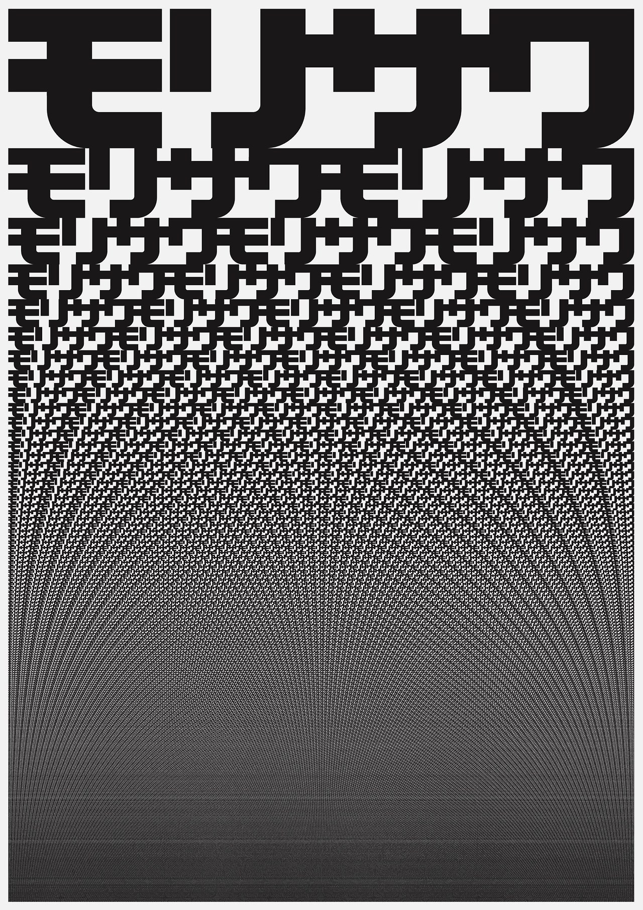
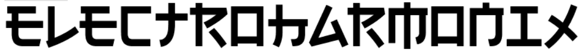
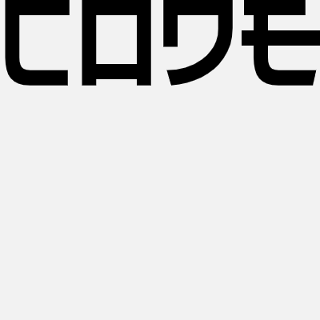
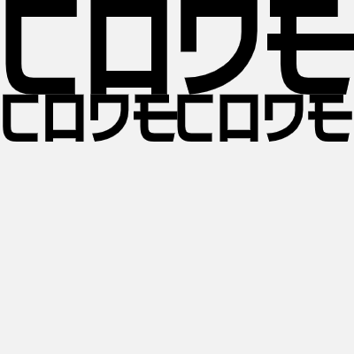
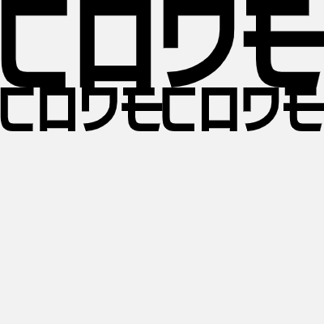
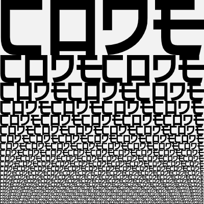
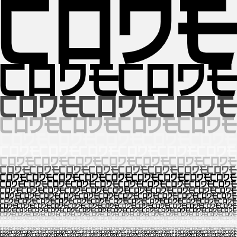

# Session 05 – Molisawa-ish by John Maeda
*by Yuguang Zhang*

The Morisawa 10 series was created by artist John Maeda in 1996 -- "... was inspired by a visit to a Shikō Munakata exhibition in Japan, and also having been fascinated by emerging methods to work with letterforms on the computer. This set of pieces won the honor of the Tokyo Type Director’s Club Gold Prize and were later accessioned into the permanent collection of the Museum of Modern Art in New York." ([Maeda Studio](https://maedastudio.com/morisawa-10-2016/)). In this tutorial you will learn how to make text compositions in the style of the 2nd one of this series using the concept of "functions" in p5.js.

You can also find a running example of this on the p5.js web editor: [Sketch Link](https://editor.p5js.org/ygzhang/sketches/hU6rBA0X9)

<p align="center">
  
</p>

## What is a function and why do we need it
A function is a block of code designed to perform a particular task. You can think of it as a series of commands bundled together - for instance, if there's a "open the door" function, then it might be comprised of commands of "1. holding the knob; 2. turning the knob; 3. push/pull the door". They're really powerful because, in many times, you would want to execute a task multiple times and across different locations in your program. Then instead of repeatedly writing the same bundle of codes again and again, you can put them inside a function, and ask the computer to execute that function instead. In fact, at this point, you've already been using a lot of built-in functions in p5.js - `rect()`, `ellipse()`, `fill()`, etc. Behind the scene, each one of them is a block of code that is built on top of the native HTML5 Canvas capabilites to provide you an easy and accessible way for creating graphic. And in p5.js (actually in almost all high level programming languages), you can also define your own functions to perform tasks as simple or as complex as possible - they'll save you time, help you better organize your code, and make your life a lot easier if you use them in the right way.

## Where to use functions
So in this tutorial, we'll use functions to recreate the John Maeda piece. But before we dive into how to make a function in p5.js, let's think about what we would like to do with the function, and where should we execute, or call, these functions in our code. And we'll start by looking at the piece itself. The composition of the piece is actually very straight forward. The entire piece is consisted entirely of the word "モリサワ" (which literally means forest and swamp) in different sizes and positions. The first line has one word, the second has two, the third has three, so on so forth. A composition like this is very ideal for functions: we are performing a task over and over again! In this case, we can deal with the repetition using loops, and use functions inside those loops to help us write the word and format it accordingly.

## What should we include in the function
The key to using functions is to determine exactly what you would like to include in your function. In other words, finding the right scope of the function so that it is not over simple (otherwise you'd be writing extra repetitive codes) or over complex (not generic enough that it won't be applicable to different situations). In creating graphics, a good way to begin with is try to write the actual codes to perform the task first (so that you can see if the block of code works or not), then wrap them into a function, and finally make adjustments if needed.

## Drawing the first line of text
So let's draw the first line of text. Since I wasn't able to find the exact same typeface that Maeda used, we'll be loading a custom font into p5 via `loadFond()` in `preload()`. This is a typeface called "electroharmonix" that give latin alphabet letters the look of a Japanese Katakana character with a style similar to the one that Maeda used, and it looks like this:

*Look closer and you'll find that these are actually English letters of "ELECTROHARMONIX" ;)*
<p align="center">
  
</p>


```js
    function preload() {
      jFont = loadFont("electroharmonix.ttf")
    }
```

In this particular example, I'm using the word "CODE" to replace "モリサワ". So we have a global variable called `t` at the top (`let t = "code";`). Then we would give the text size variable `tSize` a value of 160 so that the work would go the full width of the canvas, set is using `textSize()`, and use the `textBounds()` function to find the bounding box (bbox) of the word in a particular size, and set the y position of the text using `bbox.h`.

```js
    tSize = 160;
    textSize(tSize);
    bbox = jFont.textBounds(t, 0, 0, tSize);
    text(t, 0, bbox.h);
```
<p align="center">
  
</p>

## Drawing the first two lines of text
Similarly, we can draw the second line of text using the same strategy - we basically divided the text size by 2, and draw the text twice using the same set of commands: recalculate the text size, set the text size, recalculate the bounding box, and draw the actual word twice. Notice that we include two variables here, `curX` and `curY`, which stands for the current X and Y positons of the text to be drawn. For the second line, its `curY` value is the actually the height of the first line's bounding box; and we would update the `curX` value before we draw the second word of the second line.

```js
    tSize = 160;
    textSize(tSize);
    bbox = jFont.textBounds(t, 0, 0, tSize);
    text(t, 0, bbox.h); //finish drawing first line of text
  
    curY = bbox.h; //for line 2, set its current Y position using the height of the first line's bounding box

    tSize = tSize / 2;
    textSize(tSize);
    bbox = jFont.textBounds(t, 0, 0, tSize);
    text(t, 0, curY + bbox.h);
    curX = bbox.w; //update the current X position for the second word
    text(t, curX, curY + bbox.h);
```

<p align="center">
  
</p>

And then adjust a little bit by adding an *offset* value and making the size slightly larger, so that the text would fill up the tiny margins on the left and the right:

```js
    tSize = 162; //increaes text size a little bit
    let leftOffset = -5; //add a negative offset to fill up the margin on the left

    textSize(tSize);
    bbox = jFont.textBounds(t, 0, 0, tSize);
    text(t, 0 + leftOffset, bbox.h);
    curY = bbox.h;

    tSize = tSize / 2;
    leftOffset = leftOffset / 2;

    textSize(tSize);
    bbox = jFont.textBounds(t, 0, 0, tSize);
    text(t, 0 + leftOffset, curY + bbox.h);
    curX = bbox.w;
    text(t, curX + leftOffset, curY + bbox.h);
```
<p align="center">
  
</p>

## Define your function to do the job
At this point, we are ready to use functions to do the job. Now that we've known the drill, we can use a function to wrap the command sequences we've discovered, give it a name, and call it wherever applicable. In this case, we'll draw a line of text with our line number. To do so, we'll use the `function` keyword in JavaScript, and define a function called *drawTextLine* below our `draw()` function to draw a line of text. It'll take 6 parameters: the text content `t`, text size `tSize`, the starting X and Y positions of this line `startX` and `startY`, its offset `leftOffset`, and how many times we would draw the word `numTimes`. Also, the function will *return* a value `curY`, which indicates the current Y position of the line, so that the following line can use this information to position and draw itself.

```js
    function drawTextLine(t, tSize, startX, startY, leftOffset, numTimes) {
      textSize(tSize);
      bbox = jFont.textBounds(t, 0, 0, tSize);

      let curX = startX;
      let curY = startY + bbox.h;


      for (let i = 0; i < numTimes; i++) {
        text(t, curX + leftOffset, curY);
        curX = curX + bbox.w;
      }

      return curY;
    }
```

And now we can simplify our code inside `draw()` by calling our custom function `drawTextLine()` like below, and we'll get the same result.

```js
    //------------use a function to draw 2 lines--------------
    //1. sets the size
    //2. calculate the bbox, currentX, and currentY
    //3. draw text using currentX, currentY, left offset, and the current line number
    //4. return the updated currentY for nextline!
    tSize = 162;
    let leftOffset = -5;
    let curX = 0;
    let curY = 0;
    let newY = drawTextLine(t, tSize, curX, curY, leftOffset, 1); //draw the 1st line and save it's returned Y position to a variable newY
    drawTextLine(t, tSize/2, curX, newY, leftOffset/2, 2);//use newY to draw the second line
```

<p align="center">
  
</p>

## Draw the composition with loops
And finally we can draw the entire composition with a combination of loops. Now that we have our function ready, we would only need to properly wrap it inside the for loop, and it'll just work.

```js
    //---------------wrap them in a loop!
    tSize = 162;
    let leftOffset = -5;
    let initialX = 0;
    let initialY = 0;

    let newY = initialY;

    for (let i = 1; i < 30; i++) {
      //draw each line by using i as the line number, and the text size as i-th portion of the 1st line's text size
      newY = drawTextLine(t, tSize / i, initialX, newY, leftOffset / i, i);
    }
```

<p align="center">
  
</p>

## BONUS: Adding more stuff to our function
Since function is just a block of code, we can always modify / add codes in our function to give it more power. Here we define another function called *drawTextLineChangeColor* that does everything in *drawTextLine* plus one additional thing, changing the fill color of each line using a `sin()` function. And now we add animation to our composition :) 

```js
    function drawTextLineChangeColor(t, tSize, startX, startY, leftOffset, numTimes) {
      textSize(tSize);
      
      fill(sin(-frameCount * 0.1 + numTimes * 0.5) * 255); //same function as above, but also change color using sin();

      bbox = jFont.textBounds(t, 0, 0, tSize);

      let curX = startX;
      let curY = startY + bbox.h;


      for (let i = 0; i < numTimes; i++) {
        text(t, curX + leftOffset, curY);
        curX = curX + bbox.w;
      }

      return curY;
    }

    //and inside draw(), replace drawTextLine() with drawTextLineChangeColor()....

    newY = drawTextLineChangeColor(t, tSize / i, initialX, newY, leftOffset / i, i);

```

<p align="center">
  
</p>