# Pushin' Pusheen Pixels
###  Arrays, Objects, and Pixels
*by August Luhrs*

[Link to Final Sketch in p5 Editor](https://editor.p5js.org/augustluhrs/sketches/KUdche9rz)

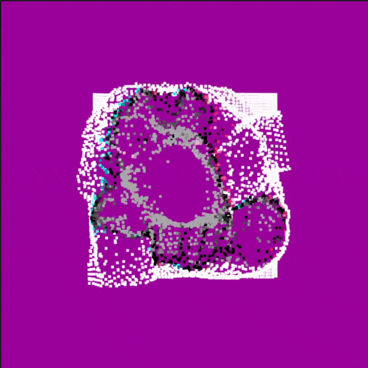

## Intro: Pixels, the Atoms of Digital Displays!

What even are pixels? You can think of pixels as the tiny building blocks of any image, specifically digital images represented on a screen. Right now the computer you're using to read this text probably has a screen resolution of around 1920 X 1080 -- that means your screen is 1920 pixels wide and 1080 pixels tall. If you were to look reallllyyyy closely at your screen (don't), you'd be able to see that every letter, color, and image is really just a bunch of dots lit up with individual colors. **Those lit dots are pixels.**

The more pixels on your screen, the more high-resolution your display is. That's why when you're watching a YouTube video, the video is sharper and clearer when you select 1080p (which stands for 1080 pixels tall), than if you select 144p (which stands for 144 potato). Why would you ever choose a lower quality though? Well, even at 144p with a resolution of 256 x 144, that means every frame of video has 256 x 144 pixels, or 36,864 individual pixels! Multiply that by a pretty low FPS (Frames Per Second) of 30FPS, and that means even just a one minute video at 144p requires displaying 66,355,200 pixels! That's a lot of information to go through, even with code. Bump it up to a nice 1080p video that runs at 60FPS for 3 minutes -- now you're talking 44,789,760,000 pixels!!! This example is simplified and doesn't take into account fancy optimization techniques like compression, but you can see why a slower computer or a weaker internet signal may prefer working with 66 million pixels over 44 billion...

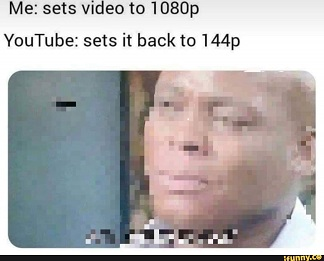

For our example, we're going to draw and manipulate some pixels using p5.js, but we're going to keep the number of pixels much lower than that so we don't blow up our computer.


But what really are pixels as seen by our computers? What do they represent? Since each of those little lit dots are colored, we can think of each pixel as the information needed for our display to know which color to light up that dot. If we imagine a deep blue pixel, say, one tiny tiny piece of the sky in this beautiful desktop landscape:

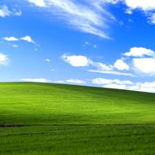

what that pixel actually represents is something like `[0,0,255]`. Where in that does it say blue? Well, without going into too much color theory, the way colors are created in most displays is through the combination of three colored lights: Red, Green, and Blue. 

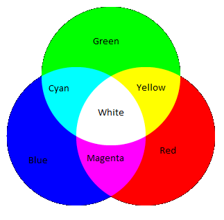

By telling each of those lights to grow brighter (255) or darker (0), we can get unique mixtures of colors. So that blue pixel, with just the blue value at 255, tells the display to show just the blue light. We can get a nice bright yellow from `[255, 255, 0]`, a full bright white at `[255, 255, 255]`, or a nice dark teal at `[0, 100, 100]`. Each pixel in a display is really three even tinier lights inside of that tiny dot:

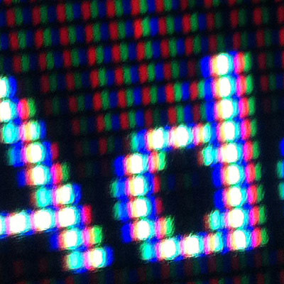

Those three numbers inside square brackets `[]` can be thought of as a set of values in a container -- that container is called an **array**. We'll go more into that later, but for now, just think about how every pixel in an image is represented by these arrays of three values, and that the entire list of thousands of values that make up the colors in an image can be called an image's **pixel array**.

## Part One: Pixel Art
In this section, we'll:
* set up our sketch and image
* start to look at the pixels that make up the image

Since we eventually want to understand how to use and mess with an image's pixel array, first we need an image! To keep things thematic, lets find a fun image that's in *pixel art* style. Pixel art refers to art that is intentionally low-resolution, a throwback to days of early video game and computer graphics when characters and images could only be represented by a very small amount of pixels -- they didn't have the computing power to handle that many values, and older displays couldn't fit as many pixels into the hardware. For example, the original Mario character was only 16 x 12 pixels!

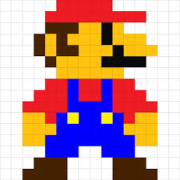

For this example, I want to use another beloved world-famous character -- *Pusheen*! Here's our pixel art Pusheen:


Notice that although the image is *stylized* like it has a super low resolution, the image itself *actually* has a size of 200x200 pixels.

Okay! Now that we have our image, let's setup our code. First off, we start with our barebones p5 sketch, just setup() and draw(), but we're going to add a variable to represent our pusheen image `let pusheen;` and we're going to `preload()` that image so we can access it later. I'll also make the background a fun magenta in draw().
```js
let pusheen;

function preload(){
  pusheen = loadImage('pixelPusheen.png');
}
function setup() {
  createCanvas(400, 400);
  console.log(pusheen.width + " " + pusheen.height);
}

function draw() {
  background(155, 0, 155);
}
```
If we `console.log()` the image's width and height, we can see that it is, in fact, 200 pixels wide by 200 pixels tall.

Now p5 has some really great built in image functions that we won't be using for this, but just to check we're loading the right image, let's show it on the canvas. Right now our canvas has a size of 400 x 400, but our Pusheen is 200 x 200. P5's built in [image function](https://p5js.org/reference/#/p5/image) has a ton of handy parameters we can set to show the image the way we want to. For example,  we can draw pusheen in the center of our canvas like so: `image(pusheen, 100, 100);`

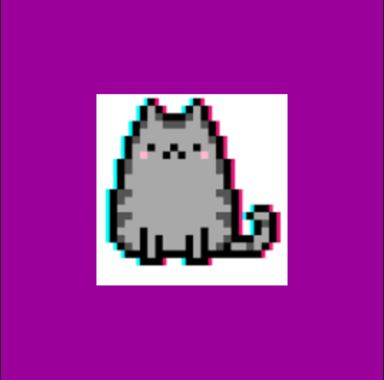

or, if we want to stretch the image over more of the canvas, we could instead write `image(pusheen, 10, 10, 380, 380)`, with the two latter parameters refering to the desired width and height we want to stretch the image to.


But, like i said, we're not interested in using the built-in image stuff. We want to be hardcore and draw the image from the pixel array! But... how do we find the pixel array? Luckily the image function has a handy pair of tools: `image.loadPixels()` and `image.pixels`. When you call .loadPixels(), it takes the information from the image and copies it into an array of values stored inside the image object itself (more on objects later), which we can then access whenever we want by using .pixels. 

*Note: there is also a cool function called `image.get()` which returns a color at a specific pixel. It can be great to use in simple examples, but if you need potentially thousands of pixels every frame, .get() is much too slow, so we won't be using it here.*

So, just to reiterate, you have to call image.loadPixels() before you can see the pixel array, and then that pixel array can be found at image.pixels. So, what happens if we do this?
``` js
pusheen.loadPixels();
console.log(pusheen.pixels); //don't actually do this!
```
Our sketch crashes haha. But that's only because there are too many values in that array to log them all to the console in the split second it takes to run the sketch once! If we could see the whole pusheen.pixels array logged, it would start out like `[255, 255, 255, 255, 255, 255, 255, 255, 255, 255, 255...]` on and on and on. But wait, didn't we say earlier that each pixel was just three numbers in an array? Why is this just one long array of values? Well, let's take a deeper look at what arrays are and how p5 represents colors in an array.

## Part Two: Arrays and For Loops, BFFs
In this section, we'll:
* break down the basics of arrays
* draw our own pixels using rect() inside a nested for loop

### Array Basics
What are arrays anyway? They're slightly different depending on which programming language you're using, but generally, you can think of arrays like a container with different slots. Imagine a train with different cars -- a *coding train* if you will -- the entire train itself is the **array**, but each individual car section is an **element** in that array, and each element can contain anything you want -- integers, variables, even other arrays! 

```js
exampleArray = [0, 1, 2];
otherArray = [circle1, circle2, rect1, rect2];
fancyArray = [exampleArray, otherArray, [0, .5, .25]];
```

Now lets say we want to open up that first train car section and put a conductor inside -- if we were talking about a real train, we'd say, open up the first car and put them in. But in arrays, we number the elements starting at 0, not 1. 

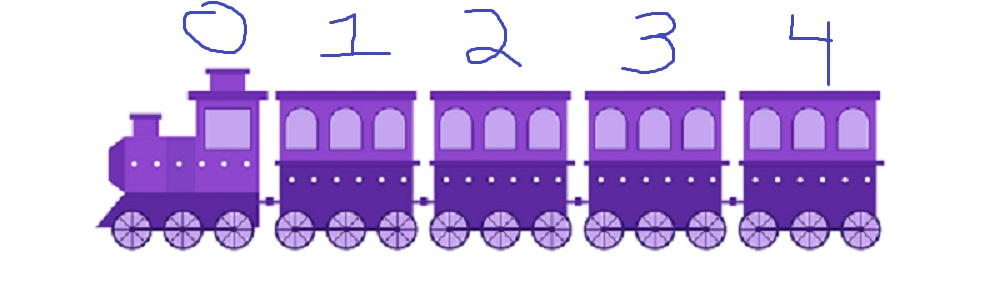

So to put a `let conductor;` variable inside the first element of our `let train = [];` array, we'd actually do it like this: `train[0] = conductor`. By using the number inside the square brackets, we tell the array which slot, or element, we want to assign to. That number `[0]` is called the **index**. Let's say we want to have an array representing a train, and each element of that array represents the number of passengers in that car:

```js
let train = []; //we could also declare the array with slots already, like let train = [0, 0, 0, 0];

//lets put two passengers in the first car at index 0
train[0] = 2;
//now lets fill in the other elements with other amounts of passengers
train[1] = 4;
train[2] = 13;
train[3] = 1;
//if we console.log() that array, we can see how many passengers are in each car, and the entire array.
console.log(train); //outputs: [2, 4, 13, 1]
//if we only want to know about one element, say, the second car, we could log:
console.log(train[1]); //outputs: 4
```

We could make this process a lot better by using an array's best friend: the *for loop*!

Let's say we already have the array from before: `[2, 4, 13, 1]`. What if we want to simulate the train going to a station and one person leaving each car? We could do something laborious like:

```js
train[0] += -1;
train[1] += -1;
train[2] += -1;
train[3] += -1;
```
But that doesn't really scale nicely to a train with 100s of cars does it?

Luckily, arrays have some built-in properties that make using for loops very powerful. You can check how many elements an array has by using `array.length` -- so for our earlier array, `train`, we would see something like: `console.log(train.length) //outputs 4` because the train array has 4 elements. So now, we can use a for loop that runs once for every element in an array:

```js
console.log(train); //outputs: [2, 4, 13, 1]
for(let i = 0; i < train.length; i++){
    train[i] += -1;
}
console.log(train); //outputs: [1, 3, 12, 0]
```

Another for loop that does almost the exact same thing is a *for-of loop*. Instead of being tied to the length of the array, it just knows to iterate through each individual element. It looks like `for(let car in train){}` where "car" is an arbitary variable name that can be whatever you want, it just represents each individual element. We won't be using that here though for various reasons, so to limit confusion, I won't be mentioning it again.

Enough trains, lets get back to images.

### Drawing Grids of Squares

First, lets refresh how we can use nested for loops to create a grid of colored shapes -- after all, an image is just a grid of colored shapes!

We want to draw a grid of squares across the whole canvas, so we're going to be looping through the width and height, but we don't want to draw one square for every single pixel in width and height -- that's just too many for p5 to handle well without other code helping. So let's establish a `stepSize`, the amount we're going to "step" through the width and height when looking for our x and y values. Let's say we know we want an 8 x 8 grid. To know how wide to make the squares, we can divide by 8 -- `400 / 8 = 50`. Since the width and height of our canvas are each 400, to have 8 squares on each column and row we need them to be 50 wide:

```js
let stepSize = 50;
for(let x = 0; x < width; x += stepSize){ //goes 0, 50, 100, 150, 200, etc. until hitting 350, the x coordinate of the last square
    for(let y = 0; y < height; y += stepSize){ // same as above, for height
        stroke(255); //white outline
        fill(0); //black color
        rect(x, y, stepSize); //draw a square at position x,y, with size equal to 50
    }
}
```
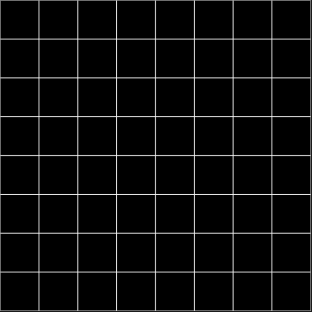

Now, if we want to change the amount of pixels, all we need to do is change the stepSize accordingly. Let's try that again, with more pixels (narrower stepSize), and let's offset it to match our pusheen in the center. Since the pusheen image is 200x200, we want to replace our width and height with 200. But that'll only draw in the top left quadrant of the canvas, so to offset the grid to the center, we're going to add 100 to the x and y position of each square. Another way of doing that would be changing the for loops themselves, something like `for(let x = 100; x < 300;x += stepSize){}`, but I think it makes more sense to put it in the rect(). You could also avoid hard-coding the offset by making it relative to the ratio of the canvas to the image, so instead of `(x + 100)`, it would be `(x + (width - pusheen.width)/2)` -- but let's ignore that in favor of simplicity.

```js
  let stepSize = 10;
  for(let x = 0; x < pusheen.width; x += stepSize){
    for(let y = 0; y < pusheen.height; y += stepSize){
      stroke(255);
      fill(0);
      rect(x + 100, y + 100, stepSize);
    }
  }
```
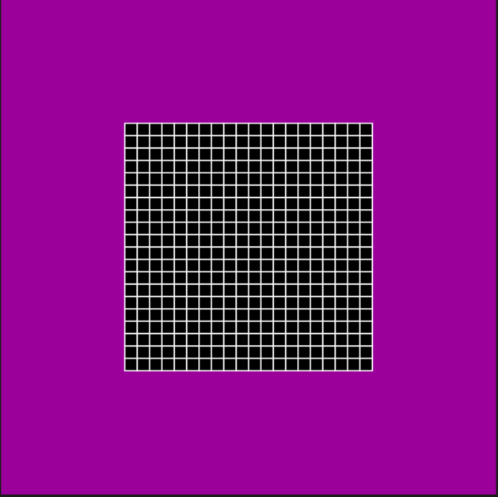

Now we have 5 times as many pixels, and they're in the center like our pusheen image!

But what good are these squares if we don't know what color to make them?

## Part Three: Using The Pixel Array
In this section, we'll:
* understand how p5.color arrays work
* look at how to use the colors in the pixel array
* get the pixel array from pusheen
* draw pusheen with variable pixel sizes

So, to refresh, a pixel's color can be represented by an array that looks like this: `[redValue, greenValue, blueValue]`. In p5, however, we actually use four values to represent RGB colors -- the fourth is the color's alpha, or transparency. So a color like `[100, 255, 100, 255]` is a bright opaque green, whereas a color like `[100, 255, 100, 50]` is a bright green that's almost entirely see-through. We'll be ignoring transparency for this example, but its important to know why each pixel is represented by four values.

So back when we did `console.log(pusheen.pixels)`, we got a super long pixel array that looked like `[255, 255, 255, 255, 255, 255, 255, 255...]`. Why? Well to save on memory, instead of the pixel array looking like `[[color1Red, color1Green, color1Blue, color1Alpha], [color2Red, color2Green, color2Blue, color2Alpha]]`, it's functionally the same just to write the same thing without separating each color by their own arrays. Since we know each array has exactly four values, all we need to do is count by 4's to get each unique set of colors. Let's take a look at this in our editor.

First, lets just see how we can take the values from an array and use them to create a color with `fill()`:

```js
//draw a color with an array of values 
let colorArray = [0, 150, 200, 255]; //r,g,b,a -- a nice blue
fill(colorArray[0], colorArray[1], colorArray[2]);  //alpha is an optional parameter that we'll ignore here 
// fill(colorArray); //note that you can also just pass in the array!
rect(250, 50, 100);
```

Now, lets draw a few different colors with a for loop, using an array of three arrays!

```js
//simple for loop using the entire array as color argument
let colorArrays = [
    [255, 100, 50, 255], //first color array at index 0 -- orange
    [100, 255, 0, 255], //second color array at index 1 -- yellowish green
    [0, 0, 255, 255] //third color array at index 2 -- blue
]; //r,g,b,a
for (let i = 0; i < colorArrays.length; i++){
    fill(colorArrays[i]);
    rect(100 * i, 100 * i, 100);
}
```


But if you recall, when we get our pixel array from pusheen, it's not neatly segmented into separate arrays, one for each pixel. It's one looooong array. How can we loop through that and still get the colors we need? Since we know each color is represented by 4 values, **we can just count in sets of 4**! It's a little confusing, so let's take a look.

How can we do the same exact code as above, but with just one array of 12 values instead of an array of 3 arrays with 4 values each?

```js
//counting through for loop in sets of 4
let longColorArray = [255, 100, 50, 255, 100, 255, 0, 255, 0, 0, 255, 255]; //same as above, just not separated
for (let i = 0; i < longColorArray.length; i += 4){ //note the incrementer of 4
    let redVal = longColorArray[i]; //so as this loops this index goes 0, 4, 8
    let greenVal = longColorArray[i+1]; //this index goes 1, 5, 9
    let blueVal = longColorArray[i+2]; //this index goes 2, 6, 10
    //we ignore alpha
    let newColor = color(redVal, greenVal, blueVal);
    fill(newColor);
    rect(i*25, i*25, 100); //multiplying by 25 to make it the same as above when we did 100 * i
}
```
Now that we can get the same values from one long array, we're ready to use our pixel array! 
<!-- But wait. If we just have one long array, that will just draw one long line of  -->

Let's experiment and see what happens if we use our pixel array in this same way, but start with smaller squares that are added from left to right...

```js
  //experimenting with pixel array
  for (let i = 0; i < pusheen.pixels.length; i += 4){ //note the incrementer of 4
    let redVal = pusheen.pixels[i];
    let greenVal = pusheen.pixels[i+1];
    let blueVal = pusheen.pixels[i+2];
    //we ignore alpha
    let newColor = color(redVal, greenVal, blueVal);
    fill(newColor);
    rect(i, 0, 4); //keeping it to the top row, and using 4 as an arbitrary size.
  }
```

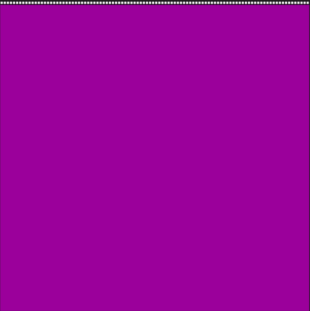

Uh oh. Well, we definitely get that white top row of the pusheen image... but it just keeps going off screen to the right. How can we know when the pixel array is moving on to the next row of the image? The same way we know to step through by 4 for each pixel -- we know how many pixels are in each row: the **width**! Here's where we'll bring in the nested for loops we were using to create our grid earlier, except now we'll also be using the width and height to know where our index is supposed to be!

So let's start by copying the grid from earlier. To avoid confusion, i'm going to change the `stepSize` variable to `pixelSize` since that's going to determine how big our pixels are. It will also determine which pixels we use for color, but we'll get into that later.

```js
//   let stepSize = 10;
  let pixelSize = 10;
  noStroke(); //we don't want the outline messing up our colors
  for(let x = 0; x < pusheen.width; x += pixelSize){
    for(let y = 0; y < pusheen.height; y += pixelSize){
    //   stroke(255);
      fill(0);
      rect(x + 100, y + 100, pixelSize);
    }
  }
```

But obviously we don't want each square to be black, we want it to be colored individually depending on the corresponding pixel from our pusheen.pixels array. We now need to change our index so that we're getting the right section of array values from row to row and column to column.

*Note:  One thing that really tripped me up when starting to learn this stuff was realizing that **`x` is for each COLUMN (sections of width), and `y` is for each ROW (sections of height)**. I always confused the two because a row goes along the width and the columns go along the height, but x and y represent the SECTIONS of those two, not the rows/columns themselves.*

```js
  //now lets add the col/row index offset

  let pixelSize = 10;
  noStroke(); //we don't want the outline messing up our colors
  for(let x = 0; x < pusheen.width; x += pixelSize){
    for(let y = 0; y < pusheen.height; y += pixelSize){
      let index = ((y*pusheen.width) + x) * 4; // this is our new index, accounting for each column and row as we move through the nested loop
      
      //the rest is the same as before, just with our new index
      let redVal = pusheen.pixels[index];
      let greenVal = pusheen.pixels[index+1];
      let blueVal = pusheen.pixels[index+2];
      //no alpha needed, ignore index+3
      let newColor = color(redVal, greenVal, blueVal);
      fill(newColor)
      rect(x + 100, y + 100, pixelSize);
    }
  }
```


Yay! We've drawn pusheen by using the pixel array! Before we move on though, let's go back and take a deeper look at that weird index offset:

`let index = ((y * pusheen.width) + x) * 4`

What's going on here? Well we need to go pixel by pixel from the top left pixel to the bottom right pixel. If we start at the top and want to draw the first row of pixels, we can use `x`, since `x` represents the x position of each pixel as we go from column to column along that first top row. `x = 0` is the first pixel, then because our step (pixelSize) is 10, our second pixel is `x = 10`. But remember, each pixel is actually represented by four values! So to make sure we're moving pixel by pixel, we need to multiply x by 4. 

At this point we've got something like `index = x * 4`, which would be fine for getting through one row, and that's actually exactly what we did earlier. 

But how do we account for moving to the next row? If we know each row has a certain number of pixels -- in this image it's a width of 200 -- then whenever we want to find pixels in another row, all we need to do is add the width to the index offset! If we wanted to find the first pixel in row 2, that index would be `index = (200 + 0) * 4` -- 200 to skip the top row of 200 pixels, 0 because that's the first pixel column (x), and *4 for each set of 4 values. 

Now, all we need to add is a multiplier on that 200 that accounts for which row we're on. Luckily we can use y for that, so let's plug that in, and replace 200 with pusheen.width (which is 200):

`let index = ((y * pusheen.width) + x) * 4`

in the abstract, you can think of it like:

`let index = ((ThisRow * NumberOfPixelsPerRow) + ThisColumn) * NumberOfValuesPerPixel`

But really, you don't have to super understand it, you can just copy and paste it from sketch to sketch like I do haha.

### Back to Pusheen!

Now that we've got squares being drawn in a grid, and those squares colored based on their corresponding location in our source image (pusheen), we can mess around with the pixelSize just for fun.

If we make `pixelSize = 1`, we get basically the exact same image as our source! Every pixel in the source image is accounted for and represented in ours. But that's 160,000 squares! If we want to start messing around with them in real-time, that's going to get very computationally expensive...

What happens if we make `pixelSize = 50` instead, so we have a 4x4 grid?


Beautiful. I can see it in a gallery already -- *Pusheen, Deconstructed*

It's interesting, you can sort of see the shape of the original image, but it's not quite zoomed in perfectly. For example, why is there a huge pink square on the right? Our original pusheen doesn't have that much pink, in fact, there's just as much blue as there is pink, and none of that made it into our 4x4 grid! Why? Well when we increase the pixelSize, we're also increasing the incrementer of our nested loop. The pixel array isn't getting "zoomed in" on, we're just going further and further between samples. So it just so happens that if you go 50 pixels at a time, when you get to the "3rd" row, you land on ONE pink pixel, which is then what we use to determine the color for that whole section. To illustrate this, lets change the stepSize super super slightly. Instead of a 4x4, lets do a 5x5 with a `pixelSize = 40`.


Now we've barely gone up in resolution, but look! We've got eyes! I think? Or ears? Who knows, but by stepping through every 40 pixels instead of 50, we've landed on more features of our source image, resulting in a slightly better quality representation. Keep that in mind when deciding how big or small to make your pixels, but mess around and see what happens!

Okay, hopefully y'all understand how we're drawing our pixels a little better. Now, let's kick things up a notch and make our pixels ~ ~ *fancy* ~ ~!

## Part Four: What if we want each pixel to be... more? Introducing Objects and Classes
In this section, we'll:
* go over objects and classes
* make a super pixel class
* draw our image with objects using the .show() method

Right now, to draw our pusheen pixels, here's what our full code looks like:

```js
let pusheen;

function preload(){
  pusheen = loadImage('pixelPusheen.png');
}
function setup() {
  createCanvas(400, 400);
  pusheen.loadPixels();
}

function draw() {
  background(155, 0, 155);

  let pixelSize = 10;
  noStroke(); //we don't want the outline messing up our colors
  for(let x = 0; x < pusheen.width; x += pixelSize){
    for(let y = 0; y < pusheen.height; y += pixelSize){
      let index = ((y*pusheen.width) + x) * 4; 

      let redVal = pusheen.pixels[index];
      let greenVal = pusheen.pixels[index+1];
      let blueVal = pusheen.pixels[index+2];

      let newColor = color(redVal, greenVal, blueVal);
      fill(newColor)
      rect(x + 100, y + 100, pixelSize);
    }
  }
}
```

Each draw loop, we're creating a whole new grid of squares based on our pusheen.pixel data, which is fine for displaying a static image, but what if we want each individual pixel to just get created once and retain its position and color no matter what weird stuff we want to do with it? It would be pretty hard to do that in this nested loop. A much better idea would be to treat each individual pixel as just that -- an individual. But there's no built-in p5 variable that stores an individual pixel with position and color, what do we do? Well... we make our own!

Introducing ***Classes*** and ***Objects***!

### Objects

**Objects** are data types that are very similar to arrays in that they are one variable that can store a lot of values inside of it. The difference is, instead of a train of sequential cars or slots, objects don't have an internal order, instead they have labels for each slot! These labels are called "keys" and the information in that slot is the "value", so each element in an object is called a "key:value" pair. Here's what our color array `[]` would look like if we decided to store it in an object `{}` instead:

```js
let colorArray = [100, 150, 200, 255]; //red, green, blue, alpha -- unlabeled but in an unchanging order
let colorObject = {
    redVal: 100,
    greenVal: 150,
    blueVal: 200,
    alphaVal: 255
};
```
In a lot of applications, objects are way better variables to use than arrays because of how these key:value pairs can be referenced. But because the values stored in an object aren't ordered, you can't go through them with the same kind of for loops we've been using. There are other fancier loops you can use to iterate through the values in an object, but we won't go over those. There's lots of fun stuff you can do with objects, but let's stick to what we need them for here. What we want is to be able to represent each of our individual pixels as an object. Something like:

```js
let onePixel = {
    xPosition: 50,
    yPosition: 100,
    pixelSize: 5,
    colorArray: [255, 0, 255, 255] //note that you can store arrays inside of objects, and vice versa! so fun!
}
```
That way whenever we want to use this pixel, we can reference its properties like so:

```js
fill(onePixel.colorArray);
rect(onePixel.xPosition, onePixel.yPosition, onePixel.pixelSize);
```

But what good is one pixel as an object? We need thousands!! And once we have them, do we have to manually say fill() and rect() for each one?? Seems like way more work than before. 

Well luckily, we can create pixel objects in the same way we're drawing our pixels, in a nested for loop. Then, once we have the object, we can store it in an array that represents all our pixel objects! That way, when we want to show them all, all we have to do is go through each element of that array. It sounds totally redundant right now -- because it is -- but just for the sake of example, lets try it.

Here's our nested loop from before, but now, let's create a new object with the values, instead of drawing the rect.

```js
//make new objects using the data we get from the pusheen pixels
for(let x = 0; x < pusheen.width; x += pixelSize){
    for(let y = 0; y < pusheen.height; y += pixelSize){
        let index = ((y*pusheen.width) + x) * 4;
        let redVal = pusheen.pixels[index];
        let greenVal = pusheen.pixels[index+1];
        let blueVal = pusheen.pixels[index+2];
        
        //   let newColor = color(redVal, greenVal, blueVal);
        //   fill(newColor)
        //   rect(x + 100, y + 100, pixelSize);
        
        let newObject = {
            xPosition: x,
            yPosition: y,
            pixelSize: pixelSize,
            colorArray: [redVal, greenVal, blueVal]
        }
    }
}
```

So now, for each square we'd normally draw, we're making a new object that is storing all that information so we don't have to go through this loop every draw()!

But how do we add it to the array we want to use to store all these objects? With a handy built-in method on all arrays called `.push()`. What `.push()` does (and don't confuse it with p5's `push() and pop()`) is take whatever value or variable is put in the parenthesis as an argument and tack it on to the end of the array, in the last slot. Take a look:

```js

let demoArray = [];
demoArray.push(20);
console.log(demoArray); //outputs: [20]
demoArray.push(1);
console.log(demoArray); //outputs: [20, 1];
demoArray.push({redVal: 10, greenVal: 200, blueVal: 0}) //pushing an object with three key:value pairs
console.log(demoArray); //outputs: [20, 1, {...}]; //expanding the object in the console would show us the rgb pairs
demoArray.push(demoArray); //weird, don't do this, just for example
console.log(demoArray); //outputs: [20, 1, {...}, [20, 1, {...}]];
```

So, to create an array of our pixel objects, all we need to do is declare the array variable globally `let ourPixels = [];`, then in our nested loop push the new object to that array `ourPixels.push(newObject);`.

That way, we can iterate through that array and show each pixel that way:

```js
for (let i = 0; i < ourPixels.length; i++){
    fill(ourPixels[i].colorArray);
    rect(ourPixels[i].xPosition, ourPixels[i].yPosition, ourPixels[i].pixelSize);
}
```

But we want to go a step further, because what if we want to be able to do more with these pixels than just show them? What if we want to move them around or more? Well, we should probably start by creating a new class.

### Classes

**Classes** can be thought of as object factories. They're templates, they don't represent actual variables, they just tell your code how to create new objects from the template.

Classes are the cookie cutters, objects are the cookies.

So let's tell our code about our fancy pixel objects and create a template for making them. They should have an epic name... ***SUPER PIXELS***!

Let's start by creating a new file for our sketch to reference that will contain our class. We could do this in the same file as sketch.js, but for cleanliness and organization, let's do it the right way.

In the p5 editor, we can add a file in the dropdown on the left and call it superPixel.js. Now, before we forget, we need to tell our index.html file that there's a new file it needs to know about. So let's go into index.html and add it:

```html
<!DOCTYPE html>
<html lang="en">
  <head>
    <script src="https://cdnjs.cloudflare.com/ajax/libs/p5.js/1.1.9/p5.js"></script>
    <script src="https://cdnjs.cloudflare.com/ajax/libs/p5.js/1.1.9/addons/p5.sound.min.js"></script>
    <link rel="stylesheet" type="text/css" href="style.css">
    <meta charset="utf-8" />

  </head>
  <body>
<!-- adding it here! -->
    <script src="superPixel.js"></script>
    <script src="sketch.js"></script>
  </body>
</html>
```

Now in our new superPixel.js file, we don't need setup() and draw() like in our sketch, because this file is just a reference that our main sketch will use whenever it needs to know how to make one of our super pixels. So all we need is a `Class` declaration, like this:

```js
Class SuperPixel{

}
```
*Important: Things can get messy fast when naming. Try and stick to the convention of **Capitalizing the Class (SuperPixel), lowercasing the individual object (superPixel), and pluralizing the array of objects (superPixels)***

Great, but how do we actually tell our code what a superPixel is supposed to be? Well the class is supposed to be the factory template right? Sounds like we need a `constructor()`! The constructor is the function that is called whenever a `new SuperPixel` is made. It's where we put all the information we used when creating the object by hand earlier (position, size, color), except now, we want to generalize the creation of the superPixel to whatever arguments are passed through when our code is creating each individual one. So we're going to establish some parameters in our constructor(), which will then define the values in our object:

```js
Class SuperPixel{
  constructor(x, y, size, col) {
    this.x = x;
    this.y = y;
    this.size = size;
    this.col = col; //note i'm not using colorArray anymore, and i can't use .color because that's a built-in property in p5 and I don't want to get confused
  }
}
```
What's cool is the `this.` in the constructor refers to "this" pixel's values. So anywhere else in the class that we use `this.`, it knows to reference its own variables.

Now, whenever we want to create a new SuperPixel, all we have to do is say `new SuperPixel` and pass in the 4 values that are needed: xPosition, yPosition, size, and color. And we can then push that new superPixel into our array `let superPixels = [];`. 

```js
let newSuperPixel = new SuperPixel(xPosition, yPosition, pixelSize, color);
superPixels.push(newSuperPixel);
```

The cool thing about classes over just normal objects is that you can also create methods for them to use -- built-in functions that each object created from that class has access to. What do we do with each of our pixels already? We `fill()` and `rect()` them, aka -- we *show* them. So let's create a new method in our SuperPixel class that can take care of *showing* each of our pixels:

```js
Class SuperPixel{
  constructor(x, y, size, col) {
    this.x = x;
    this.y = y;
    this.size = size;
    this.col = col; 
  }
  show() {
    fill(this.col);
    rect(this.x, this.y, this.size);
  }
}
```

Now, just by calling superPixel.show(), we can draw that particular pixel with it's own unique x, y, and color -- found using the `this.` values we assigned when creating them!

So let's add it all together and change our sketch.js to now use our object creation and .show():

```js
let pusheen;
let pixelSize = 5;
let superPixels = [];

function preload(){
  pusheen = loadImage('pixelPusheen.png');
}
function setup() {
  createCanvas(400, 400);
  noStroke();
  pusheen.loadPixels();
  
  //make new object pixels using the data we get from the pusheen pixels
  for(let x = 0; x < pusheen.width; x += pixelSize){
    for(let y = 0; y < pusheen.height; y += pixelSize){
      let index = ((y*pusheen.width) + x) * 4;
      let redVal = pusheen.pixels[index];
      let greenVal = pusheen.pixels[index+1];
      let blueVal = pusheen.pixels[index+2];
      
      let newCol = color(redVal, greenVal, blueVal); // we could have made an array like last time, but this is just to show another way of creating a color, with the built-in color Class!
      let newPixel = new SuperPixel(x + 100, y + 100, pixelSize, newCol);
      superPixels.push(newPixel);
    }
  }
}

function draw() {
  background(155, 0, 155);
  
  for(let i = 0; i < superPixels.length; i++){
    superPixels[i].show();
  }
}
```

This may not seem much different, but since we only create pixels once during setup() now, this frees us up to do some wayyyy cooler stuff in draw().

## Part Five: Pushin' Pusheen Pixels
In this section, we'll:
* add a repulsion method
* add a goHome method
* toggle the goHome method with a mouse click
* marvel in the wonder of our super pixels

Almost done! Now for some fancy stuff. How cool would it be if each pixel could move around based on user input? Or if each pixel always knew where it was "supposed" to be, and tried getting back there? Let's get creative.

### Repulsion

I want to make it so these pixels are repulsed by the user's mouse -- whenever the mouse gets too close, they get pushed back. 

There are a ton of fun ways to do this with vectors and acceleration and other physics-y things, but to keep things relatively simple, I'm going to code an easy way to move the pixel opposite the mouse -- by assigning it a new x and y position that's farther away from the mouse. Here's the code, and then I'll break it down:
```js
//in draw loop
  for(let i = 0; i < superPixels.length; i++){
    if(dist(mouseX, mouseY, superPixels[i].x, superPixels[i].y) < 30){ //only calling repel when mouse is within 30 of the pixel
      superPixels[i].repel(mouseX, mouseY);  //passing the mouse position as arguments in our repel method
    }
    superPixels[i].show();
  }
```
```js
class SuperPixel {
  constructor(x, y, size, col) {
    this.x = x;
    this.y = y;
    this.size = size;
    this.col = col;
    this.easing = 0.08; //notice we added this "easing" property
  }
  show() {
    // noStroke();
    fill(this.col);
    rect(this.x, this.y, this.size);
  }
  repel(mX, mY) {
    let repelX = mX - this.x; //find the distance between the mouse and this pixel
    this.x -= repelX * this.easing; //make the new pixel position equal to the opposite (-=) of that force, scaled down by the easing to make the motion smooth

    let repelY = mY - this.y;
    this.y -= repelY * this.easing;
  }
```

I wish I had a great diagram that could show what these `repelX` and `repelY` variables are doing, but all you need to know to make it work is that they're measuring the distance between the mouse and the pixel, and then changing the pixel's position by the *opposite* of that distance (so if the mouse is to the right, make the pixel go left). 

That movement is scaled by a new property, `this.easing = 0.08`, which we assign at construction even though we're not passed an argument for it (it's the same for all pixels). What the easing does is make the movement smoother by only moving it a little bit every frame (8% of the total movement). If we didn't ease the movement, the pixel would just jump to the outer limit right away.

Now, we get this really fun interaction, where our mouse can move through the pixels like Moses parting the Pusheen Sea.

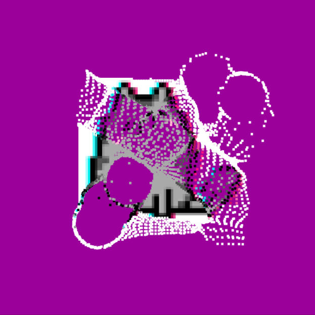

### Go Home

But what if we want the pixels to eventually go back to their spot? Since we're manipulating their `this.x` and `this.y` when we repel them, they've totally lost all sense of "home". So lets add new properties to the constructor that can be their memory of home:

```js
class SuperPixel {
  constructor(x, y, size, col) {
    this.x = x;
    this.y = y;
    this.homeX = x; //this is the same as starting x, but it's never changed, so it always knows where home is.
    this.homeY = y;
    this.size = size;
    this.col = col;
    this.easing = 0.08;
  }
```

Now, to make them go home, we can just do the opposite of our repel() method and create a goHome() method:
```js
  goHome() {
    let newX = this.homeX - this.x; // notice we're doing the same thing as repel, but now it's the distance between home and pixel, not mouse and pixel
    this.x += newX * this.easing; // and instead of -=, we use +=

    let newY = this.homeY - this.y;
    this.y += newY * this.easing;
  }
```

If we add this to our draw(), now they'll all fall back in line:
```js
//in draw(
for(let i = 0; i < superPixels.length; i++){
    if(dist(mouseX, mouseY, superPixels[i].x, superPixels[i].y) < 30){ //only calling repel when mouse is within 30 of the pixel
      superPixels[i].repel(mouseX, mouseY);  //passing the mouse position as arguments in our repel method
    }
    superPixels[i].goHome();
    superPixels[i].show();
}
```
*Notice that we call both repel() and goHome() methods before .show(), since we need to know where the pixels are before we show them there.*


### Mouse Click

Lastly, just for kicks, lets add a boolean toggle that can switch between whether we want them to always goHome() or not. Now when we click, they'll either stay pushed around, or they'll try to go home. (Full code at bottom).


If you're interested in going further, here's one last bit of inspiration: ***you can get a pixel array from a webcam...*** [Here's a great tutorial from Allison Parrish on doing just that.](https://creative-coding.decontextualize.com/video/)

Thanks y'all!

The link to the editor is at the top, but here's the full code, and the project files can be found in this github folder.

### Sketch.js
```js
let pusheen;
let pixelSize = 3;
let superPixels = [];
let isStickingTogether = false;

function preload(){
  pusheen = loadImage('pixelPusheen.png');
}
function setup() {
  createCanvas(400, 400);
  noStroke();
  pusheen.loadPixels();
  
  //make new object pixels using the data we get from the pusheen pixels
  for(let x = 0; x < pusheen.width; x += pixelSize){
    for(let y = 0; y < pusheen.height; y += pixelSize){
      let index = ((y*pusheen.width) + x) * 4;
      let redVal = pusheen.pixels[index];
      let greenVal = pusheen.pixels[index+1];
      let blueVal = pusheen.pixels[index+2];
      //no alpha needed, ignore index+3
      let newCol = color(redVal, greenVal, blueVal);
      let newPixel = new SuperPixel(x + 100, y + 100, pixelSize, newCol);
      superPixels.push(newPixel);
    }
  }
}

function draw() {
  background(155, 0, 155);
  
  for(let i = 0; i < superPixels.length; i++){
    if(dist(mouseX, mouseY, superPixels[i].x, superPixels[i].y) < 30){
      superPixels[i].repel(mouseX, mouseY);  
    }
    if(isStickingTogether){
      superPixels[i].goHome();
    }
    superPixels[i].show();
  }
}

function mousePressed(){
  isStickingTogether = !isStickingTogether;
}
```


### superPixel.js
```js
class SuperPixel {
  constructor(x, y, size, col) {
    this.x = x;
    this.y = y;
    this.homeX = x;
    this.homeY = y;
    this.size = size;
    this.col = col;
    this.easing = 0.08;
  }
  
  repel(mX, mY) {
    let repelX = mX - this.x;
    this.x -= repelX * this.easing;

    let repelY = mY - this.y;
    this.y -= repelY * this.easing;
  }

  goHome() {
    let newX = this.homeX - this.x;
    this.x += newX * this.easing;

    let newY = this.homeY - this.y;
    this.y += newY * this.easing;
  }

  show() {
    fill(this.col);
    rect(this.x, this.y, this.size);
  }
}
```
