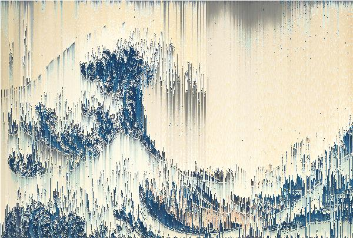
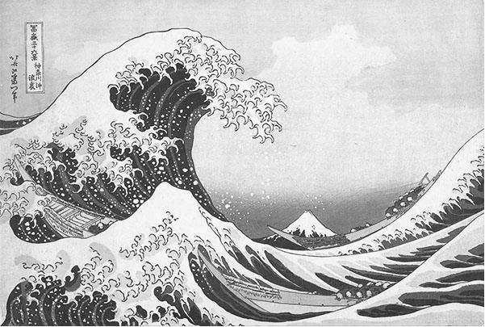

# Session 08 – Pixel Sorting
*by Yuguang Zhang*

Pixel sorting is an interesting, glitchy effect which selectively orders the pixels in the rows/columns of an image. It was popularized (possibly invented) by artist Kim Asendorf. [(Post Link)](http://satyarth.me/articles/pixel-sorting/) This week we'll look into how to pixel sort the famouse print of "
The Great Wave off Kanagawa" by artist Hokusai in p5.js by using its built-in `pixels` arry. You can find a running example of this on the p5.js web editor: [(Sketch Link)](https://editor.p5js.org/ygzhang/sketches/uco7ZltvL). NOTE: try to open it in Firefox instead of Chrome if it appears laggy.

<p align="center">
  
</p>

## Brief Intro to Pixel Sorting Algorithm & The Built-in PIXELS Array in p5
The way pixel sorting works is basically swapping, or changing, the orders of pixels on each row & column using an arbitrary criteria (hence "sorting"), such as brightness or hue. At a high level, it works like this:
```js
  // 1. get all the pixels of an image
  // 2. sort pixels in each row by a criteria
  // 3. sort pixels in each column by a criteria
  // 4. update the pixel values
```
But first off, what are pixels?

In [session 6](https://github.com/itpresidents/icm-help-sessions-2020/blob/master/session-06/session-06-example.md), [@augustluhrs](https://github.com/augustluhrs) covered in detail the concepts of pixel and how you can use it in p5. (Definitely check it out if you haven't already!). Basically, pixels are the building blocks / smallest units of any image. An image can be seen as a grid of pixels with a specific amount of rows and columns, and each pixel is a "cell" of the grid. The color of each pixel is represented as a combination of red, green, and blue values, plus alpha. In p5, you can get pixel values of your entire canvas or an image using the `get()` function, or use the built-in, global `pixels` array that stores all of the pixel values. 

To use the `pixels` array, you'll need to first draw the wave image onto the canvas by using `image()`, then call `loadPixels()` to get all the drawn pixel values into the `pixels` array, then make modifications to each pixel's RGBA values, and finally call  `updatePixels()` to see the changes in effect.

```js

  image(waveImg, 0, 0);
  loadPixels();

  //some code here to modify the values in the pixels array
  pixels[0] = 10;
  pixels[1] = 20;
  pixels[2] = 30;
  pixels[3] = 40;
  ...

  updatePixels();
```
Then, with this `pixels` array, our sorting algorithm inside the `draw()` function may look something like this:
```js
  // these are pseudo code, just to illustrate the idea
  image(waveImg, 0, 0);
  loadPixels();

  sortRow(pixels);
  sortColumn(pixels);

  updatePixels();
```
In this example, we'll be using brightness as our criteria for sorting.

## Using Nested Loops to Get Monochrome Brightness Image
Now let's begin by getting a monochrome version of the wave image, so that we can use it as the basis for sorting. The way to get it is by averaging the RGB values of each pixel and set it to all RGB channels. If the resolution of your canvas is 400 x 400, there'll be 160, 000 pixels. If we consider the four channels of each pixel (RGBA), there'll be 160,000 x 4 = 640, 000 values for us to work on! That's almost impossible if we want to manually update their values one by one. Then, how exactly can we make changes? The answer is to use loops - by using 2 nested for loops, one iterating through pixels by row, the other by column, we can get the pixel values on each x, y position on the canvas. Here is an axample of looping through the pixels and get the brightness value of each pixel. Notice that there's an `idx` variable that keeps track of each pixel's location on the screen `idx = (i * width + j) * 4;` (the reason to * 4 is because each pixel has four channels, RGBA).

```js
  function getBrightnessPixels(originalPixels) {
    let brightnessPixels = [];
    for (let i = 0; i < height; i++) {
      for (let j = 0; j < width; j++) {
        let idx = (i * width + j) * 4;
        let r = originalPixels[idx];
        let g = originalPixels[idx + 1];
        let b = originalPixels[idx + 2];
        let brightness = (r + g + b) / 3;

        brightnessPixels.push(brightness);
      }
    }
    return brightnessPixels;
  }
```
And to make the monochrome wave image, we just sets the RGB value of each pixel to the calculated brightness value.
```js
  loadPixels();

  //get the brightness representation of all pixels
  bPixels = getBrightnessPixels(pixels);
  
  for (let i = 0; i < height; i++) {
    for (let j = 0; j < width; j++) {
      let bIdx = (i * width + j);
      let idx = bIdx * 4;

      pixels[idx] = bPixels[bIdx];
      pixels[idx + 1] = bPixels[bIdx];
      pixels[idx + 2] = bPixels[bIdx];
      pixels[idx + 3] = 255;
    }
  }

  updatePixels();
```

<p align="center">
  
</p>

## Group the Pixels for Sorting
You might have noticed that, pixels in the `pixels` array are actually "flattened", meaning that the values are ordered as [R1, G1, B1, A1, R2, G2, B2, A2, ...] instead of [[R1, G1, B1, A1], [R2, G2, B2, A2], ...]. However, in pixel sorting, we need to moving the entire pixel (each has four channel values) around. So we need to somehow group or pack them together, so that the sorting won't accidentally pair up the R value of pixel A with the B value of pixel B. So we can make a `getGroupedPixels()` function that helps us to group the pixels in units of 3 (since we don't need alpha information here). Then we can do sorting based these grouped pixels, and finally apply changes back to the original `pixels` array.
```js
  function getBrightnessPixels(originalPixels) {
    let brightnessPixels = [];
    for (let i = 0; i < height; i++) {
      for (let j = 0; j < width; j++) {
        let idx = (i * width + j) * 4;
        let r = originalPixels[idx];
        let g = originalPixels[idx + 1];
        let b = originalPixels[idx + 2];
        let brightness = (r + g + b) / 3;

        brightnessPixels.push(brightness);
      }
    }
    return brightnessPixels;
  }

  //Then inside draw:

  image(waveImg, 0, 0);
  loadPixels();

  sortRow(groupedPixels);
  sortColumn(groupedPixels);
  updatePixels();
```
## How to Sort a Row/Column
Now it's time to sort the pixels by row and column. The way to do that is actually very simple in JavaScript - arrys in JavaScript has a built-in `.sort()` function! So all we need to do is to grab a row/column of pixels, save them to a temporary array, and call `array.sort()`. Below is a `sortRow()` function that takes in the grouped pixels, sort its designated rows, and apply the changes to the original pixels array of the canvas. (There's also a `sortColulmn()` function that does exactly the same thing but just doing it by columns.) The grabbing is done by using `.slice()`, and then sort by calling `rowToSort.sort()`.
```js
  function sortRow(groupedPixels, originalPixels, startRow, endRow) {

    for (let i = startRow; i < endRow; i++) {
      //----------------- method 1: sort the entire row ----------------
      let startX = i * width;
      let endX = i * width + width;
      let rowToSort = groupedPixels.slice(startX, endX);
      rowToSort.sort();
      for (let j = 0; j < width; j++) {
        let idx = (i * width + j) * 4;
        originalPixels[idx] = rowToSort[j][0];
        originalPixels[idx + 1] = rowToSort[j][1];
        originalPixels[idx + 2] = rowToSort[j][2];
      }
    }
  }
```
Then in `draw()`, we can sort the top half of the image like this:
```js
  image(waveImg, 0, 0);
  loadPixels();
  sortRow(groupedPixels, pixels, 0, height/2);
  updatePixels();
```

<p align="center">
  
</p>

On top of this, we can also selectively sort part of the row/column by giving it a start and an end. The method below is calculating a random start X position and a random end X position of a row, grab the section of pixels between the start and the end, then just apply sorting to this section.

```js
  function sortRow(groupedPixels, originalPixels, startRow, endRow) {

    for (let i = startRow; i < endRow; i++) {
      //----------------- method 2: sort a random portion of the row -----------------------
      let startX = floor(random(width / 4));
      let endX = floor(random(width / 4, width / 2));
      let portionBefore = groupedPixels.slice(i * width, i * width + startX);
      let portionToSort = groupedPixels.slice(i * width + startX, i * width + endX);
      let portionAfter = groupedPixels.slice(i * width + endX, i * width + width);

      portionToSort.sort();
      let rowToSort = portionBefore.concat(portionToSort, portionAfter);

      for (let j = 0; j < width; j++) {
        let idx = (i * width + j) * 4;
        originalPixels[idx] = rowToSort[j][0];
        originalPixels[idx + 1] = rowToSort[j][1];
        originalPixels[idx + 2] = rowToSort[j][2];
    }
    }
  }
```
<p align="center">
  
</p>

Finally, we can break down a row/column into multiple sections by brightness values, and apply sortings to each section individually. To do so, we can look for the first pixel in a row that has a brightness value greater than a threshold we defined (e.g. 50), then look for the following pixel with a brightness value smaller than that threshold, and turn anything in-between into a section for sorting. Then look for the second section, and third, so on so forth.
```js
  function sortRow(groupedPixels, originalPixels, startRow, endRow) {

    for (let i = startRow; i < endRow; i++) {
      //---------------- method 3: sort by brightness -----------------------------
      let startX = 0;
      let endX = 0;

      while (endX < width - 1) {

        startX = getFirstBrightX(startX, i);
        endX = getNextDarkX(startX, i);

        if (startX < 0) break;

        let sortLength = endX - startX;

        let unsorted = [];
        let sorted = [];

        for (let j = 0; j < sortLength; j++) {
          unsorted[j] = groupedPixels[startX + j];
        }

        sorted = unsorted.sort();

        for (let j = 0; j < sortLength; j++) {
          let idx = (i * width + startX + j) * 4;
          originalPixels[idx] = sorted[j][0];
          originalPixels[idx + 1] = sorted[j][1];
          originalPixels[idx + 2] = sorted[j][2];
        }

        startX = endX + 1;
      }
    }
  }
```

Then we can apply both row sorting and column sorting in `draw()`, and we'll get the pixel sorting effect. Notice that a mapping from mouseX to the threshold, bThres, is done to see the different sorting result based on different threshold. If you have time, also check out the code of the helper functions `getFirstBrightX()`, `getNextDarkX()`, `getFirstBrightY()`, `getNextDarkY()` in the source file to see what's happening under the hood.

```js
  image(waveImg, 0, 0);
  bThres = int(map(mouseX, 0, width, 0, 255));
  
  loadPixels();
  sortRow(groupedPixels, pixels, 0, height);
  sortColumn(groupedPixels, pixels, 0, width);
  updatePixels();
```
<p align="center">
  
</p>

